# Plotting energyRt objects

`energyRt` ships
[`autoplot()`](https://ggplot2.tidyverse.org/reference/autoplot.html)
methods (and, where natural, matching
[`plot()`](https://rdrr.io/r/graphics/plot.default.html) methods) for
most of its building-block classes. They turn an object into a `ggplot`,
so the result can be themed and extended with `+` layers like any other
ggplot.

| Class | What the plot shows |
|----|----|
| `calendar` | the sub-annual time structure (stacked timeframe rows) |
| `horizon` | the planning intervals / milestone years |
| `commodity` | emission factors (`@emis`) — one or several commodities |
| `supply`, `demand`, `import`, `export` | level parameters over years (given data + interpolation) |
| `weather` | a sub-annual capacity/availability factor (heatmap, line or area) |

``` r

library(energyRt)
library(ggplot2)   # provides the autoplot() generic
```

## Calendars

The example `calendars` dataset holds a few ready-made `calendar`
objects.

``` r

data("calendars", package = "energyRt")
names(calendars)
#> [1] "season_dn"                      "d365"                          
#> [3] "utopia_annual"                  "utopia_seasons"                
#> [5] "utopia_s4h24"                   "utopia_m12h24"                 
#> [7] "d365_h24"                       "d365_h24_subset_1day_per_month"
```

[`autoplot()`](https://ggplot2.tidyverse.org/reference/autoplot.html)
(or the equivalent
[`plot()`](https://rdrr.io/r/graphics/plot.default.html)) draws each
timeframe as a row of rectangles sized by each slice’s share of the
year:

``` r

autoplot(calendars$season_dn)
```

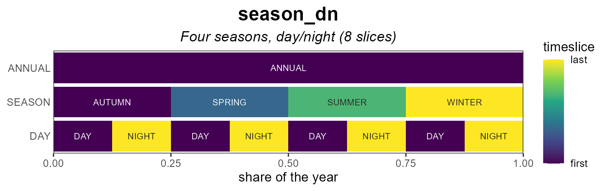

### Coloring

For `fill = "order"` (the default) the `color_pattern` controls the
gradient. `"within"` (default) colours each level over **its own**
slices — so an hourly row shows a full `h00`→`h23` cycle repeating every
day, while `"global"` colours by absolute chronology across the whole
year.

``` r

autoplot(calendars$d365_h24)                          # within (default)
```

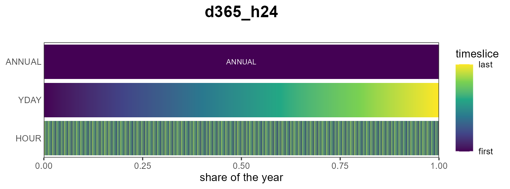

``` r

autoplot(calendars$d365_h24, color_pattern = "global")
```

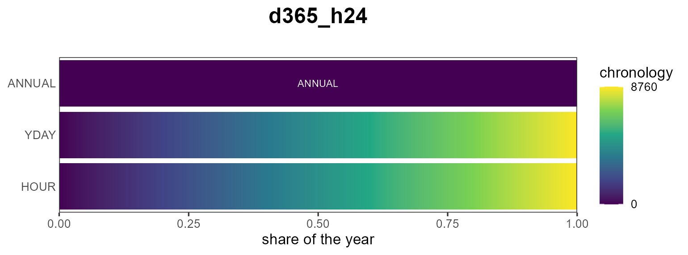

Other fill metrics are the slice `"share"` and `"weight"`:

``` r

autoplot(calendars$season_dn, fill = "share")
```

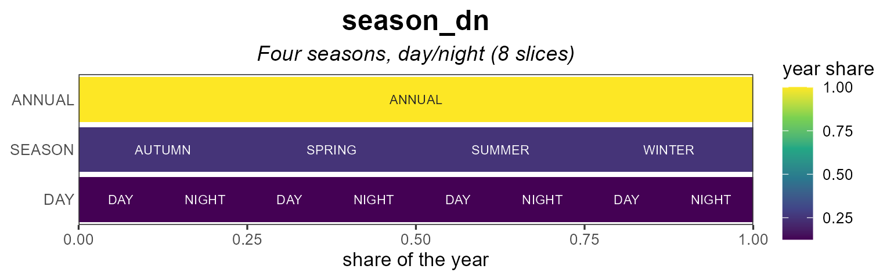

### Labels

Each cell can be labelled by its individual level name (`"name"`, the
default, e.g. `h00`…`h23`) or by the full slice path (`"slice"`,
e.g. `d001_h00`). Label text auto-contrasts with the fill; override it
with `label_color`.

``` r

# zoom (see below) so labels are legible
autoplot(calendars$d365_h24,
         show_leafs = list(YDAY = "d001", HOUR = 1:24),
         label_by = "name")
```

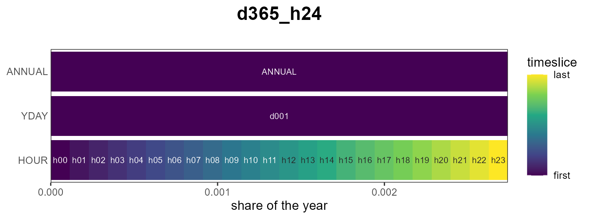

### Zooming with `show_leafs`

`show_leafs` selects which slices to draw. Pass a named list to filter
per timeframe level (character = slice names, numeric = positions among
that level’s slices), or an unnamed vector to filter the finest level
directly.

``` r

# day 100, hours 5-10
autoplot(calendars$d365_h24, show_leafs = list(YDAY = "d100", HOUR = 5:10))
```

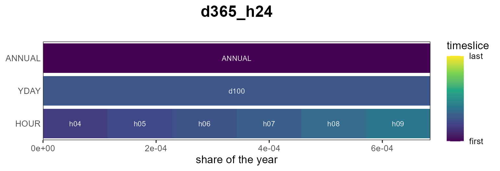

``` r


# the first 48 leaf slices (first two days)
autoplot(calendars$d365_h24, show_leafs = 1:48)
```

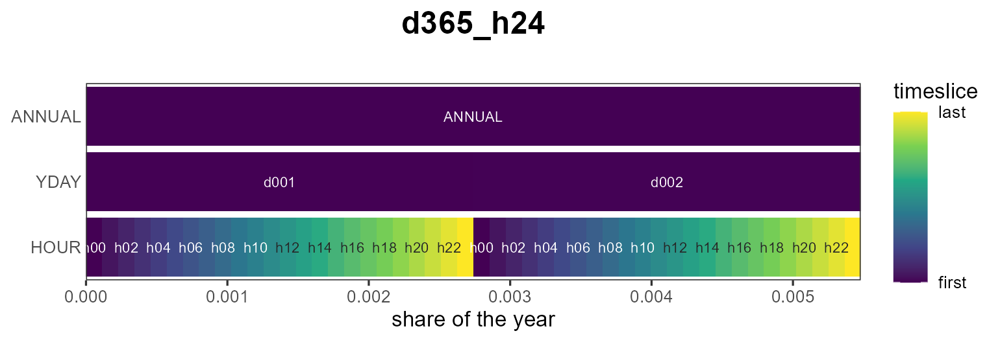

### Subset view

A reduced calendar can be shown against a full reference calendar: pass
the full one as `reference`. The slices present in the subset are
filled; the rest are left empty.

``` r

autoplot(calendars$d365_h24_subset_1day_per_month,
         reference = calendars$d365_h24)
```

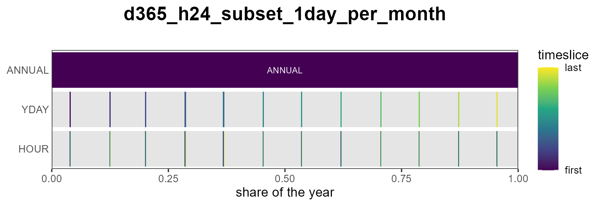

### Styling

`border` outlines the rectangles (off by default so dense rows read as a
smooth gradient) and `palette` picks the viridis option; and because the
result is a ggplot you can keep customizing it:

``` r

autoplot(calendars$season_dn, palette = "magma", border = "grey40") +
  labs(title = "Four seasons, day/night") +
  theme_minimal()
```

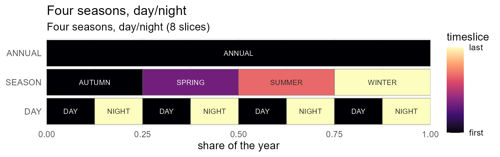

## Heatmaps

[`autoplot()`](https://ggplot2.tidyverse.org/reference/autoplot.html)
lays every slice out in one row per timeframe. When a value is indexed
by a *two-dimensional* calendar — day-of-year × hour, month × hour — a
**heatmap** reads more naturally:
[`plot_heatmap()`](https://energyRt.org/reference/plot_heatmap.md) puts
the finest timeframe on `y`, the next on `x`, and any coarser levels
into facets. The layout is taken from the calendar (pass it as
`calendar =`), or guessed from the slice names with
[`tsl_guess_format()`](https://energyRt.org/reference/tsl_guess_format.md).

Here is a synthetic hourly load profile on the `d365_h24` calendar (a
daily cycle plus a seasonal swing). The diurnal band and the
winter/summer contrast are immediately visible:

``` r

cal  <- calendars$d365_h24
tt   <- cal@timetable
prof <- data.frame(
  slice = tt$slice,
  load  = 50 + 30 * sin(2 * pi * (tsl2hour(tt$slice) - 6) / 24) +
                15 * cos(2 * pi *  tsl2yday(tt$slice)      / 365))

plot_heatmap(prof, calendar = cal, value = "load")   # x = YDAY, y = HOUR
```

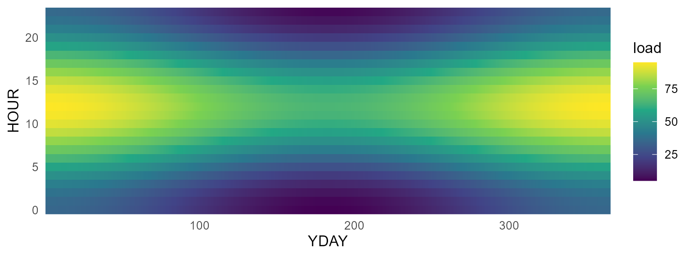

Facet a day-of-year format by `"month"` to get one day-of-month × hour
panel per month:

``` r

plot_heatmap(prof, value = "load", facet = "month")  # 12 monthly panels
```

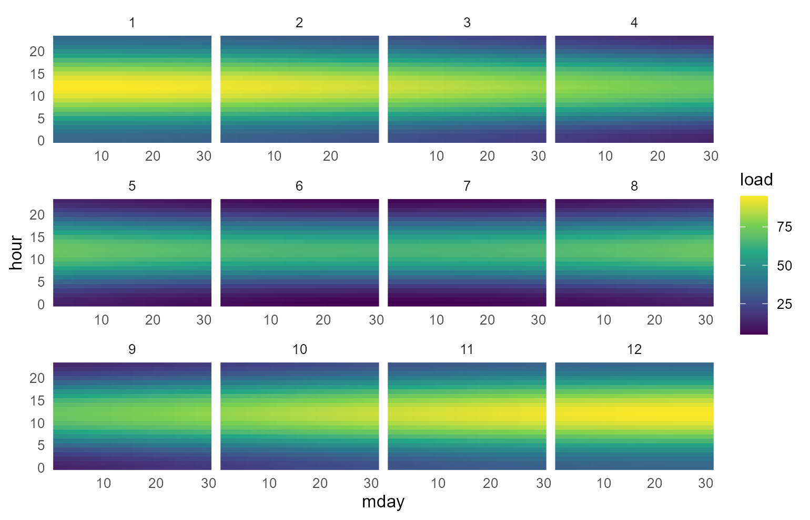

`palette` selects the viridis option and `name` labels the colour bar,
exactly as for
[`autoplot()`](https://ggplot2.tidyverse.org/reference/autoplot.html).

### From model objects

Any slice-indexed model data lays out the same way. Here **electricity
demand** and a **solar capacity factor** from the packaged UTOPIA kit,
on its season × hour calendar (`utopia_s4h24`): pull the object with
[`getObject()`](https://energyRt.org/reference/getObject.md), take one
region (and, for demand, one year), and pass the `slice` + value columns
to [`plot_heatmap()`](https://energyRt.org/reference/plot_heatmap.md).
The `name` argument carries the value’s unit onto the colour bar.

``` r

repo <- utopia_modules$electricity$reg3$repo
wcal <- calendars$utopia_s4h24

DEM <- getObject(repo, name = "DEM_ELC", drop = TRUE)
dem <- subset(as.data.frame(DEM@dem), region == "R1" & year == 2050)
plot_heatmap(dem[, c("slice", "dem")], calendar = wcal, value = "dem", name = "PJ")
```

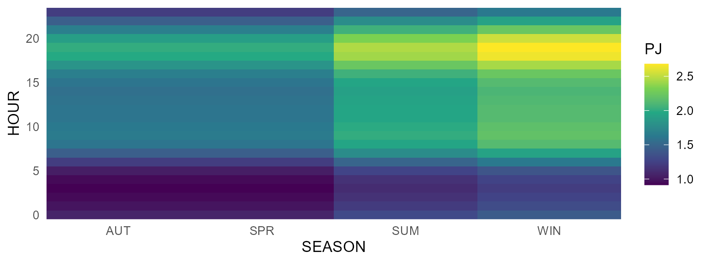

``` r

WSOL <- getObject(repo, name = "WSOL", drop = TRUE)
wsol <- subset(as.data.frame(WSOL@weather), region == "R1")
plot_heatmap(wsol[, c("slice", "wval")], calendar = wcal, value = "wval",
             name = "capacity factor")
```

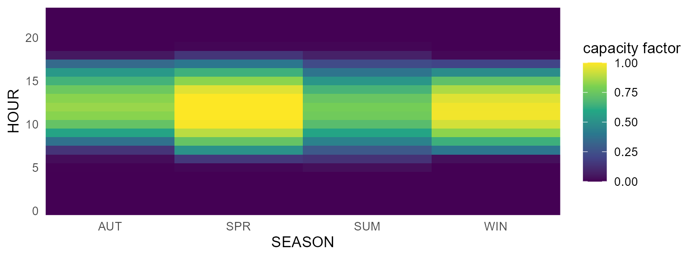

The weather heatmap is exactly what
[`autoplot()`](https://ggplot2.tidyverse.org/reference/autoplot.html)
draws for a `weather` object directly — with line and area variants too
(see *Weather* below).

## Horizons

`horizon` objects draw the modelled intervals over milestone years:

``` r

data("horizons", package = "energyRt")
autoplot(horizons$Y2020_2060_by_5)
```

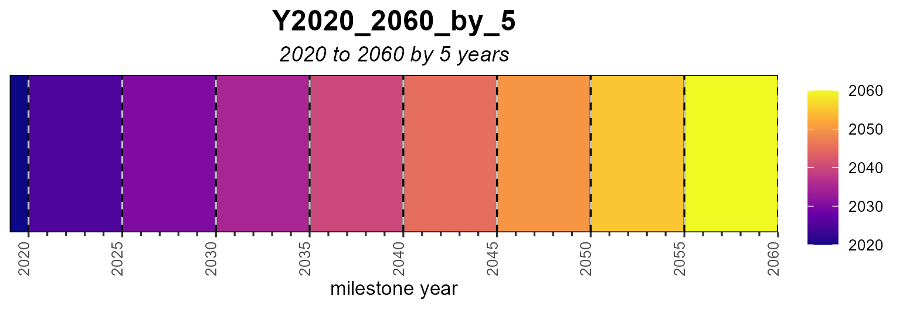

## Commodities

For a `commodity`,
[`autoplot()`](https://ggplot2.tidyverse.org/reference/autoplot.html)
shows its emission factors (`@emis`). Passing several commodities
compares their emission intensities side by side.

``` r

COA <- newCommodity("COA", desc = "Coal",
                    emis = data.frame(comm = "CO2", unit = "kt/GWh", emis = 0.33))
OIL <- newCommodity("OIL", emis = data.frame(comm = "CO2", unit = "kt/GWh", emis = 0.25))
GAS <- newCommodity("GAS", emis = data.frame(comm = "CO2", unit = "kt/GWh", emis = 0.18))

autoplot(COA)                 # a single commodity
```

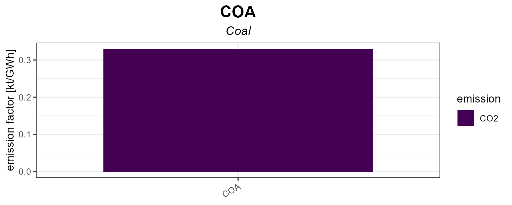

``` r

autoplot(COA, OIL, GAS)       # comparison
```

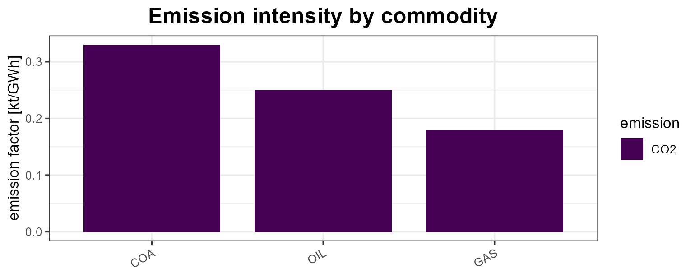

## Supply, demand, import, export

These process objects are plotted by year: the **points** are the given
data and the **lines** are the interpolation (both extracted with
[`getData()`](https://energyRt.org/reference/getData.md)). Level
parameters are faceted by their base name so bounds and prices/costs
keep separate y-scales.

``` r

SUP_COA <- newSupply(
  name = "SUP_COA", commodity = "COA", unit = "PJ", region = "R1",
  availability = data.frame(
    region = "R1", slice = "ANNUAL",
    year   = c(2020, 2040, 2020, 2020),
    ava.up = c(100,  200,  NA,   NA),
    ava.lo = c(NA,   NA,   10,   NA),
    cost   = c(NA,   NA,   NA,   30)))
autoplot(SUP_COA)
```

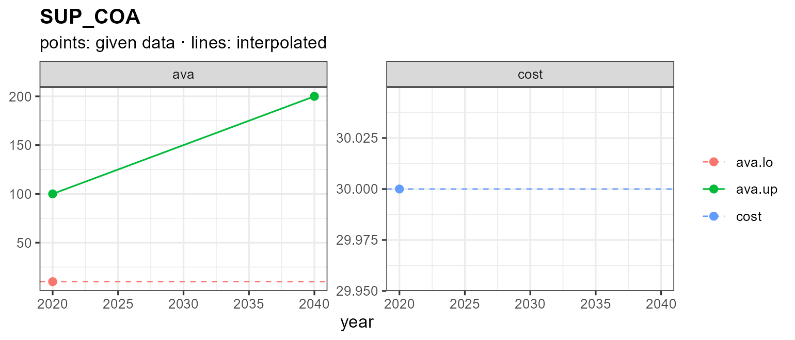

A single given value (or none) is drawn as a flat dashed line showing
the interpolation direction. Pass `years` to interpolate over a specific
horizon:

``` r

autoplot(SUP_COA, years = 2020:2050)
```

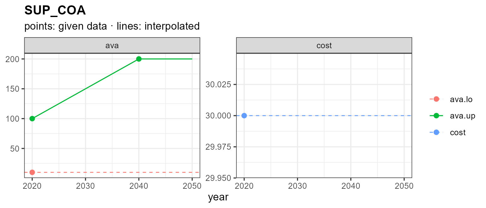

Demand, import and export follow the same pattern:

``` r

DEM_ELC <- newDemand(
  name = "DEM_ELC", commodity = "ELC", unit = "GWh",
  dem = data.frame(region = "R1", slice = "ANNUAL",
                   year = c(2020, 2030, 2050), dem = c(100, 150, 300)))
autoplot(DEM_ELC)
```

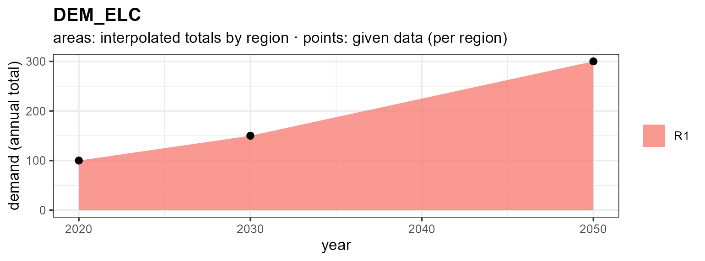

``` r

IMP_GAS <- newImport(
  name = "IMP_GAS", commodity = "GAS",
  imp = data.frame(region = "R1", slice = "ANNUAL",
                   year = c(2020, 2050), imp.up = c(50, 80), price = c(5, 9)))
autoplot(IMP_GAS)
```

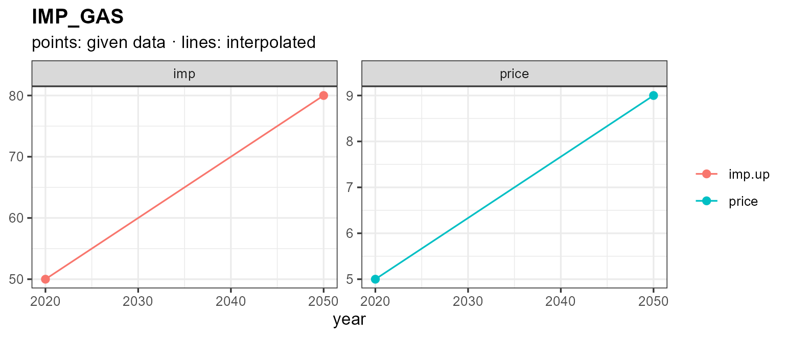

## Weather

`weather` objects hold a sub-annual factor — a capacity / availability
factor — per region and slice.
[`autoplot()`](https://ggplot2.tidyverse.org/reference/autoplot.html)
offers three views via `type =`: a calendar **heatmap** (the default),
and diurnal **line** / **area** charts. Because the slice layout (here
season × hour) can’t be inferred from the slice names alone, pass the
model’s `calendar`; the value’s unit (`@unit`, or `"capacity factor"`
when unset) labels the value axis — the fill legend for the heatmap, the
y-axis for line/area.

``` r

WSOL <- getObject(utopia_modules$electricity$reg3$repo, name = "WSOL", drop = TRUE)
wcal <- calendars$utopia_s4h24

autoplot(WSOL, calendar = wcal)                    # heatmap (default), faceted by region
```

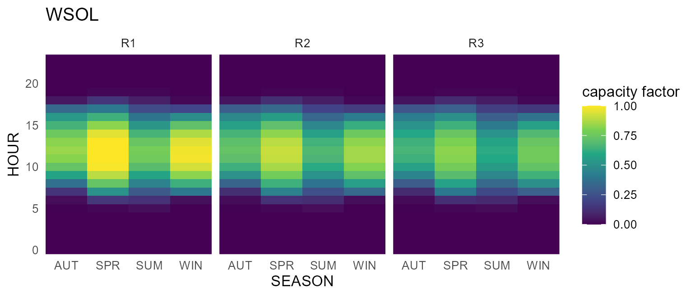

The **line** view reads the diurnal shape directly — one line per
season, the capacity factor on the y-axis:

``` r

autoplot(WSOL, type = "line", calendar = wcal)
```

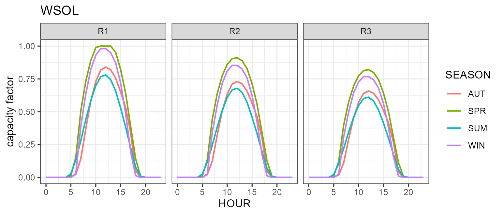

``` r

autoplot(WSOL, type = "area", calendar = wcal)     # or filled areas
```

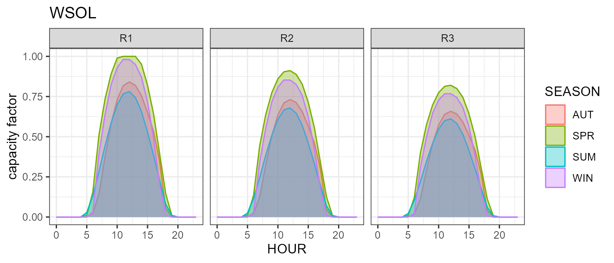

## Notes

- Every method returns a `ggplot`, so `+ theme_*()`, `+ labs()`,
  `+ scale_*()` etc. all work.
- [`plot()`](https://rdrr.io/r/graphics/plot.default.html) is available
  for `calendar` and `horizon` and produces the same figure as
  [`autoplot()`](https://ggplot2.tidyverse.org/reference/autoplot.html).
- [`autoplot()`](https://ggplot2.tidyverse.org/reference/autoplot.html)
  also works on the result of
  [`levcost()`](https://energyRt.org/reference/levcost.md) (levelized
  cost) — see [`?levcost`](https://energyRt.org/reference/levcost.md) —
  but that requires solving a small model, so it is not shown here.
- See
  [`?autoplot.calendar`](https://energyRt.org/reference/plot_calendar_method.md),
  [`?autoplot.commodity`](https://energyRt.org/reference/autoplot.commodity.md),
  [`?autoplot.supply`](https://energyRt.org/reference/autoplot.process.md),
  and [`?plot_weather`](https://energyRt.org/reference/plot_weather.md)
  for the full list of arguments.
