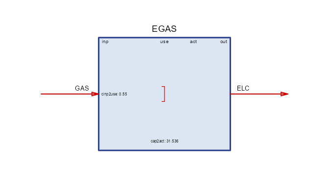

# Introduction to energyRt

## The idea

An energy system is a network of **flows**: primary resources are
extracted or harvested, converted by technologies, moved, stored, and
finally consumed as useful energy. Planning such a system — what to
build, when, and how to run it — is an optimization problem: meet demand
in every place and moment at the lowest total cost, subject to physics
and policy.

**energyRt** is a macro-language for stating that problem in R. You
describe the *system* — fuels, technologies, resources, demands — as R
objects, and the package compiles them into a full capacity-expansion
and dispatch optimization model: it derives the sets, writes the
equations, runs a solver, and returns the solution as tidy tables. The
modeling layer (hundreds of index-mapping and bookkeeping decisions) is
generated, so your code stays at the level of the energy system itself.

## One model, four backends

The energyRt optimization model — around one hundred predefined
equations, extendable with
[`newConstraint()`](https://energyRt.org/reference/newConstraint.md) —
is implemented in four mathematical programming languages:

- **GLPK / MathProg** — open source; bundled with Rtools on Windows, so
  it works out of the box;
- **Julia / JuMP** — open source, with fast solvers like HiGHS;
- **Python / Pyomo** — open source, CBC/HiGHS and others;
- **GAMS** — the commercial standard in energy-systems work.

The *same* model object solves on any backend with consistent results —
start on GLPK with zero setup, switch to a faster or institutional
solver later without touching your model. The full mathematical
formulation is documented in the [model equations
PDF](https://energyrt.org/articles/energyRt_model_equations.pdf); the
[solver backends article](https://energyrt.org/articles/backends.html)
covers configuration.

## The bricks

Models are assembled from a small set of object types:

| Brick | Constructor | Role |
|----|----|----|
| commodity | [`newCommodity()`](https://energyRt.org/reference/newCommodity.md) | an energy carrier or accounting flow (GAS, ELC, CO2) |
| technology | [`newTechnology()`](https://energyRt.org/reference/technology.md) | a conversion process — the richest object |
| supply | [`newSupply()`](https://energyRt.org/reference/newSupply.md) | a source: fuel at a price, or a free resource |
| demand | [`newDemand()`](https://energyRt.org/reference/newDemand.md) | a sink: final consumption to be met |
| storage | [`newStorage()`](https://energyRt.org/reference/storage.md) | shifts a commodity across time slices |
| weather | [`newWeather()`](https://energyRt.org/reference/newWeather.md) | capacity factors and other exogenous profiles |
| repository | [`newRepository()`](https://energyRt.org/reference/newRepository.md) | a bag of bricks — the parts library |
| model | [`newModel()`](https://energyRt.org/reference/newModel.md) | repository + regions + calendar + horizon |
| scenario | [`interpolate_model()`](https://energyRt.org/reference/interpolate_model.md) / [`solve_scenario()`](https://energyRt.org/reference/solve_model.md) | a model instance, solved |

A technology converts inputs to outputs through the chain
`input → use → activity → output`; costs, capacity, availability,
emissions and secondary flows all attach to it. The [model bricks
article](https://energyrt.org/articles/model-bricks.html) walks through
every object in depth.

## A five-minute model

One fuel, one power plant, one demand — a complete, solvable system:

``` r

GAS <- newCommodity("GAS", timeframe = "ANNUAL")
ELC <- newCommodity("ELC", timeframe = "ANNUAL")

SUP_GAS <- newSupply("SUP_GAS", commodity = "GAS",
                     availability = data.frame(cost = 6.0))   # fuel price, MEUR/PJ

EGAS <- newTechnology("EGAS",
  input   = list(comm = "GAS"), output = list(comm = "ELC"),
  ceff    = data.frame(comm = "GAS", cinp2use = 0.55),        # 55% efficient
  invcost = list(invcost = 900),                              # MEUR/GW
  fixom   = 25, cap2act = 31.536, olife = 25L)

DEM_ELC <- newDemand("DEM_ELC", commodity = "ELC",
                     dem = data.frame(dem = 50))               # 50 PJ a year

draw(EGAS)
```



Bind the bricks to space and time, and solve on GLPK:

``` r

mod <- newModel("HELLO",
  data    = newRepository("parts", GAS, ELC, SUP_GAS, EGAS, DEM_ELC),
  region  = "R1", discount = 0.05,
  horizon = newHorizon(period = 2025:2040, intervals = c(1, 5, 10),
                       mid_is_end = TRUE))

scen <- solve_scenario(interpolate_model(mod, name = "BASE"),
                       solver = solver_options$glpk,
                       echo = FALSE)    # echo = FALSE silences the solver log
```

Results come back as tidy tables:

``` r

getData(scen, "vObjective", merge = TRUE)   # total discounted system cost, MEUR
#> # A tibble: 1 × 3
#>   scenario name       value
#>   <chr>    <chr>      <dbl>
#> 1 BASE     vObjective 6677.
getData(scen, "vTechCap",   merge = TRUE)   # capacity the model built, GW
#> # A tibble: 3 × 6
#>   scenario name     tech  region  year value
#>   <chr>    <chr>    <chr> <chr>  <int> <dbl>
#> 1 BASE     vTechCap EGAS  R1      2025  1.59
#> 2 BASE     vTechCap EGAS  R1      2030  1.59
#> 3 BASE     vTechCap EGAS  R1      2040  1.59
```

The model built 1.59 GW of gas capacity — exactly enough to deliver 50
PJ a year — and the solution reports every flow, cost, and capacity
variable at the same level of detail.

## How it stands out

**One language end to end.** Data preparation, model formulation,
solving, and analysis all happen in R: your inputs arrive via the
tidyverse, and results return as tibbles ready for `dplyr` and
`ggplot2`. There is no export-import seam between the model and your
analysis.

**Solver independence.** Institutional modeling ecosystems typically
bind you to one platform. energyRt’s four equivalent backends mean a
class can run on GLPK, a research group on JuMP, and an agency on GAMS —
same model, same results.

**Built for scale.** A sparse interpolation engine materializes only the
set-tuples a scenario needs, and scenarios are stored in Arrow-backed
folders
([`save_scenario()`](https://energyRt.org/reference/save_scenario.md) /
[`load_scenario()`](https://energyRt.org/reference/load_scenario.md))
that load lazily — larger-than-memory results remain workable.

**Analysis built in.**
[`levcost()`](https://energyRt.org/reference/levcost.md) prices a
technology *a-priori* (a textbook LCOE from a unit-demand mini-model) or
*ex-post* from a solved scenario;
[`report()`](https://energyRt.org/reference/report.md) renders a
technology or process datasheet;
[`draw()`](https://energyRt.org/reference/draw.md) diagrams any
technology;
[`autoplot()`](https://ggplot2.tidyverse.org/reference/autoplot.html)
covers calendars, commodities, weather, costs and more.

**A complete teaching model.** The UTOPIA electricity model ships with
the package — both as step-by-step vignettes and as the ready
`utopia_modules` data kit with scenario levers (CO₂ cap, carbon tax,
renewable share, nuclear moratorium) — so the path from “hello world” to
policy analysis is paved.

energyRt sits alongside established energy-modeling frameworks (the
TIMES/MESSAGE/OSeMOSYS family) as an R-native alternative: the same
class of capacity-expansion models, formulated and analyzed without
leaving R.

## Where next

1.  [Model bricks](https://energyrt.org/articles/model-bricks.html) —
    every object type in depth, including fuel blends, auxiliary flows,
    and user constraints.
2.  [`vignette("utopia-build")`](https://energyRt.org/articles/utopia-build.md)
    — *UTOPIA I*: build a multi-region electricity model brick by brick.
3.  [`vignette("utopia-use")`](https://energyRt.org/articles/utopia-use.md)
    — *UTOPIA II*: solve it and run policy scenarios.
4.  [Solver backends](https://energyrt.org/articles/backends.html) —
    GLPK, JuMP, Pyomo, GAMS, and NEOS.
5.  [Workflow](https://energyrt.org/articles/workflow.html) —
    extracting, editing, saving and comparing scenarios.
