# Model bricks

An energyRt model is assembled from a small set of building blocks —
*bricks*:

- **commodities** — the things that flow (fuels, electricity, heat,
  emissions, materials);
- **processes** — the elements that move and convert them (supply,
  demand, trade, storage, technologies …);
- **user constraints** — extra linear limits you impose on the solution
  (an emission cap, a build limit);
- **structures** — the containers that hold everything: a
  **repository**, a **model**, and a **scenario**.

This article walks through each brick and how it is drawn.

``` r

library(energyRt)
library(ggplot2)   # for the emission-intensity plots
data("calendars", package = "energyRt")
```

## Commodities

A **commodity** is any quantity that flows through the model. Energy
carriers (`COA`, `GAS`, `ELC`, `HEAT`), environmental accounting
commodities (`CO2`, `NOx`) and materials (`WATER`, `MAT`) are all
commodities — they differ only in which processes produce and consume
them.

A fuel commodity can carry **emission factors** (`emis`): how much of an
environmental commodity is released per unit burned. `timeframe` sets
the finest calendar level at which the commodity is tracked.

``` r

COA <- newCommodity("COA", desc = "Coal", timeframe = "ANNUAL",
                    emis = data.frame(comm = "CO2", unit = "kt/PJ", emis = 95))
GAS <- newCommodity("GAS", desc = "Natural gas", timeframe = "ANNUAL",
                    emis = data.frame(comm = "CO2", unit = "kt/PJ", emis = 56))
ELC  <- newCommodity("ELC",  desc = "Electricity", timeframe = "HOUR")
HEAT <- newCommodity("HEAT", desc = "Heat",        timeframe = "HOUR")
CO2  <- newCommodity("CO2",  desc = "Carbon dioxide")   # accounting commodity
names(getData(COA))
#> [1] "emis"
```

Because a commodity’s emission factors are just data, they can be
compared with
[`autoplot()`](https://ggplot2.tidyverse.org/reference/autoplot.html)
(see the *autoplot* article for the full set of arguments):

``` r

autoplot(COA, GAS)   # emission intensity of the two fuels
```

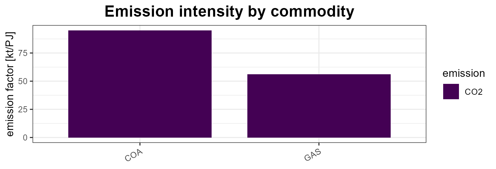

## Processes

**Processes** are the model elements that move and convert commodities.
energyRt has seven of them, and every one has a
[`draw()`](https://energyRt.org/reference/draw.md) method that renders a
schematic of its inputs, outputs, auxiliary commodities and key
coefficients.

| Process | Role | Main commodity flow |
|----|----|----|
| `supply` | domestic source of a commodity | → out |
| `demand` | final consumption (a sink) | in → |
| `import` | purchase from the rest of the world | → out |
| `export` | sale to the rest of the world | in → |
| `trade` | move a commodity between regions | in ↔︎ out (per region) |
| `storage` | shift a commodity across time | in → 
``` math
store
```
 → out |
| `technology` | convert input commodities into outputs | in → **use → activity** → out |

### supply

A source of a commodity, with an availability bound and a cost (see the
*autoplot* article for the by-year view of the same data).

``` r

SUP_COA <- newSupply(
  name = "SUP_COA", desc = "Coal supply", commodity = "COA", unit = "PJ",
  reserve = data.frame(region = "R1", res.up = 2e5),
  availability = data.frame(region = "R1", year = NA_integer_, slice = "ANNUAL",
                            ava.up = 1e3, cost = 10))
draw(SUP_COA)
```

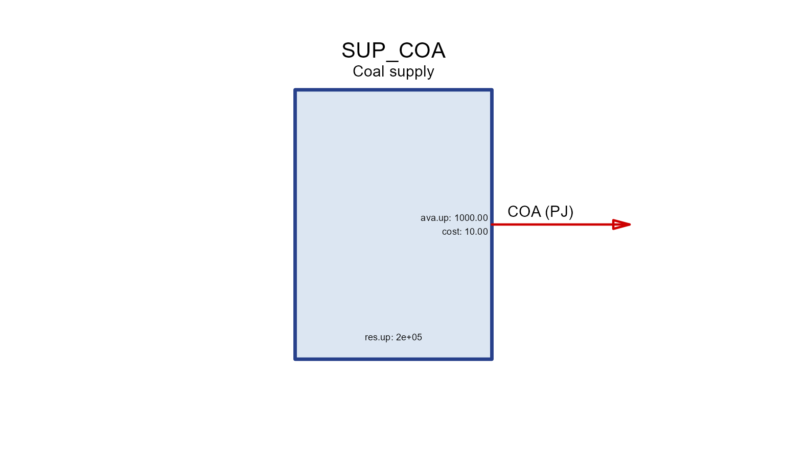

### demand

A commodity sink; `dem` is the demanded quantity over years/slices.

``` r

DEM_ELC <- newDemand(
  name = "DEM_ELC", desc = "Electricity demand", commodity = "ELC", unit = "GWh",
  dem = data.frame(region = "R1", year = c(2020, 2050), slice = "ANNUAL",
                   dem = c(100, 300)))
draw(DEM_ELC)
```

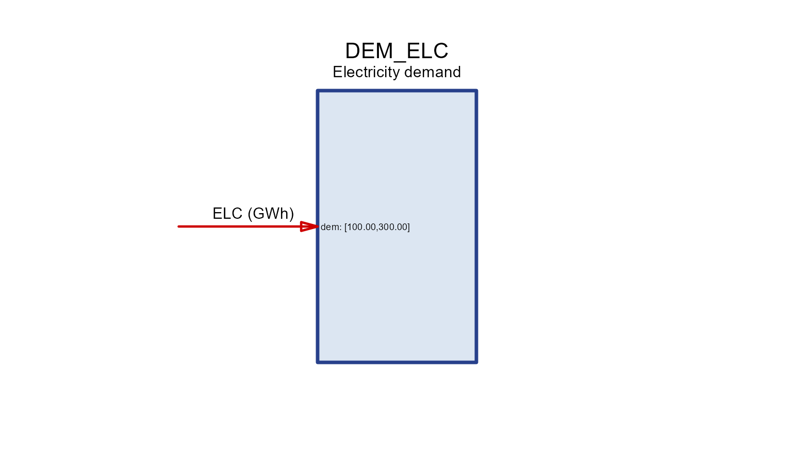

### import / export

Trade with the “rest of the world” at a `price`, bounded by `imp.*` /
`exp.*`.

``` r

IMP_GAS <- newImport(
  name = "IMP_GAS", desc = "Gas import", commodity = "GAS", unit = "PJ",
  imp = data.frame(region = "R1", year = c(2020, 2050), price = 6, imp.up = 500))
draw(IMP_GAS)
```


``` r


EXP_OIL <- newExport(
  name = "EXP_OIL", desc = "Oil export", commodity = "OIL", unit = "Mt",
  exp = data.frame(region = "R1", year = c(2020, 2050), price = 500, exp.up = 100))
draw(EXP_OIL)
```


### trade

Moves a commodity along `routes` (`src` → `dst`) between regions with a
transport efficiency `teff`.
[`draw()`](https://energyRt.org/reference/draw.md) shows the flows for
one node at a time.

``` r

PIPE <- newTrade(
  name = "PIPE", desc = "Gas pipeline", commodity = "GAS",
  routes = data.frame(src = c("R1", "R2"), dst = c("R2", "R3")),
  trade  = data.frame(src = c("R1", "R2"), dst = c("R2", "R3"), teff = c(0.97, 0.96)))
draw(PIPE, node = "R2")   # imports from R1, exports to R3
```

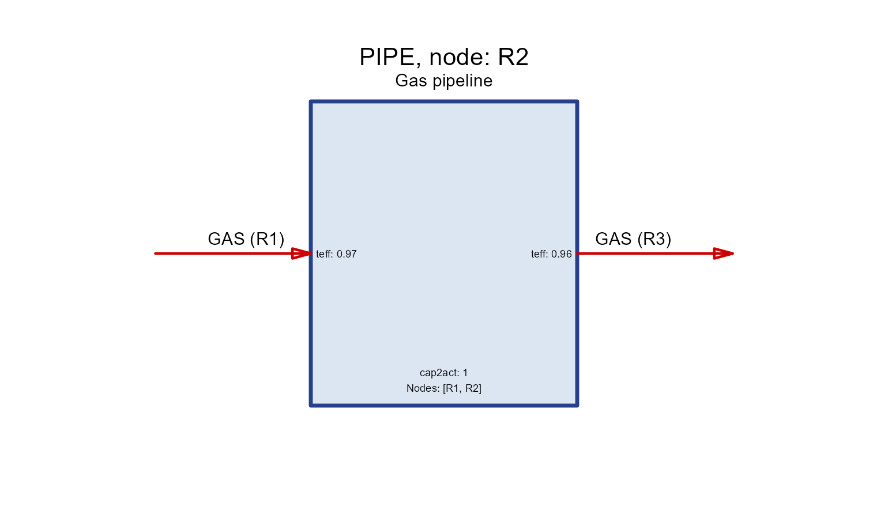

### storage

Shifts a commodity across time. `seff` holds the
charging/discharging/holding efficiencies (`inpeff`/`outeff`/`stgeff`)
and `cap2stg` is the storage duration.

``` r

STG_ELC <- newStorage(
  name = "STG_ELC", desc = "Battery", commodity = "ELC",
  seff = data.frame(inpeff = 0.9, outeff = 0.9, stgeff = 0.999),
  cap2stg = 4,                                   # 4 hours of storage per unit power
  aux  = data.frame(acomm = "MAT", unit = "kt"),
  aeff = data.frame(acomm = "MAT", ncap2ainp = 0.25))  # material per new capacity
draw(STG_ELC)
```

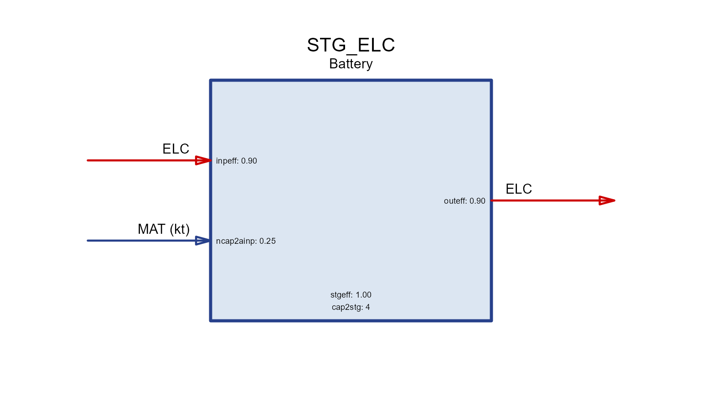

### Anatomy of a technology

A `technology` converts **input** commodities into **output**
commodities. Read its diagram left-to-right through four internal
stages:

       input(s)  ──▶  use  ──▶  activity  ──▶  output(s)
                 cinp2use   use2cact      cact2cout

- **`cinp2use`** — how much of a common *use* each unit of a commodity
  input provides (e.g. converting fuels to a common energy basis).
- **`use2cact`** — *use* to the technology’s **activity** (the central
  variable that all costs, availability and capacity are tied to).
- **`cact2cout`** — activity to each **output** commodity (efficiency /
  yield). All three default to `1`.

``` r

BOILER <- newTechnology(
  name = "BOILER", desc = "Gas boiler",
  input  = data.frame(comm = "GAS",  unit = "PJ"),
  output = data.frame(comm = "HEAT", unit = "PJ"),
  ceff = data.frame(comm = c("GAS", "HEAT"),
                    cinp2use  = c(1,  NA),
                    cact2cout = c(NA, 0.9)),   # 90% efficiency
  cap2act = 1)
draw(BOILER)
```


The four column headers in the box (`inp`, `use`, `act`, `out`) are
exactly these stages; each coefficient is printed next to the flow it
scales.

#### Groups and shares

When several commodities are interchangeable on the input (or output)
side, put them in a **group**. A group is converted to *use* once (via
`ginp2use` in `geff`), and each member’s contribution is bounded by a
**share** (`share.lo`/`share.up`/`share.fx`). `cinp2ginp` converts each
commodity into the group’s common unit.

``` r

CHP <- newTechnology(
  name = "CHP", desc = "Co-firing plant (coal + biomass)",
  input = data.frame(comm = c("COA", "BIO"), group = "fuel", unit = "PJ"),
  output = data.frame(comm = "ELC", unit = "GWh"),
  group = data.frame(group = "fuel", desc = "Blended fuel", unit = "PJ"),
  # inputs are PJ but the output is GWh: the PJ->GWh conversion (1 PJ =
  # 277.78 GWh) rides on `ginp2use`, so use/activity are measured in GWh
  geff  = data.frame(group = "fuel", ginp2use = 277.78),
  ceff  = data.frame(comm = c("COA", "BIO", "ELC"),
                    cinp2ginp = c(1, 1, NA),
                    cact2cout = c(NA, NA, 0.4),     # 40% efficiency
                    share.up  = c(1.0, 0.3, NA)),   # at most 30% biomass
  cap2act = 8760)                                   # 1 GW x 8760 h = 8760 GWh
draw(CHP)
```

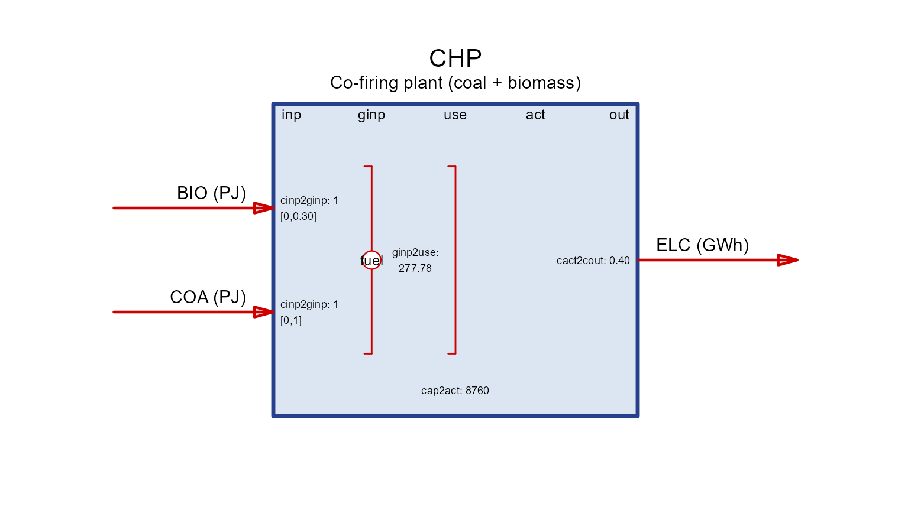

The share range is drawn in square brackets next to each grouped
commodity.

**Mixed units live in the coefficients.** When inputs and outputs use
different units, a unit conversion must ride on one of the chain
coefficients so that *use*, *activity* and `cap2act` agree. Here the
fuels are PJ and electricity is GWh: `ginp2use = 277.78` converts the
fuel group to GWh (so the technology *operates* in GWh), and
`cap2act = 8760` matches (1 GW × 8760 h). Keeping every commodity in one
unit family (as UTOPIA does with PJ) avoids the gymnastics —
`convert("PJ", "GWh", 1)` tells you the factor when you can’t.

#### Activity, capacity and units

Everything a technology does is measured by its **activity**. Installed
**capacity** limits the *maximum* activity through the scalar `cap2act`:

- `cap2act` — “how much product (activity, or output commodity if
  identical) is produced per unit of capacity”. For a power plant with
  capacity in `GW`, `cap2act = 8.76` gives a maximum activity of
  `8.76 GWh` per `GW` per year (8760 h, scaled to the cost/energy units
  in use).
- Capacity itself is bounded in the `capacity` slot: `stock`
  (pre-existing), `cap.lo/up/fx` (total), `ncap.lo/up/fx` (new builds)
  and `ret.lo/up/fx` (retirement). Availability factors `af`/`afs` bound
  activity within capacity.

##### Capacity in input vs. output units

Because capacity is tied to **activity**, whether it is expressed in
*input* or *output* units depends on where you place the efficiency.
Keep `cinp2use = 1` and put the loss on the output (`cact2cout = 0.9`)
and activity tracks the **input** — so capacity is in fuel-input units.
Move the efficiency to the input side instead and capacity becomes an
**output** rating:

``` r

# capacity rated on OUTPUT (e.g. a 1 GW_e turbine): activity == output
BOILER_out <- newTechnology(
  name = "BOILER_out", desc = "Boiler rated by heat output",
  input  = data.frame(comm = "GAS",  unit = "PJ"),
  output = data.frame(comm = "HEAT", unit = "PJ"),
  ceff = data.frame(comm = c("GAS", "HEAT"),
                    cinp2use  = c(1 / 0.9, NA),   # efficiency on the input side
                    cact2cout = c(NA, 1)),        # activity == heat output
  cap2act = 1)
draw(BOILER_out)
```

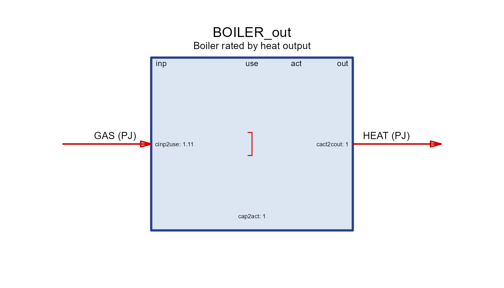

Both boilers have the same 90% efficiency; they differ only in what a
unit of capacity *means* (fuel input vs. heat output).

#### Auxiliary commodities

**Auxiliary** commodities are extra flows tracked alongside the main
conversion — emissions (`NOx`, `SO2`, `CH4`, `PM10`, `PM25`), recovered
`HEAT`, land, cooling `WATER`, construction `MAT`erials, by-products.
They are declared in `aux` and linked in `aeff` by a coefficient named
`<driver>2a<out|inp>`:

- the **driver** is what scales the flow: `cinp` (commodity input),
  `cout` (output), `act` (activity), `cap` (installed capacity), `ncap`
  (new capacity), or storage terms;
- `…2aout` **produces** the aux commodity (emissions, recovered heat,
  by-products); `…2ainp` **consumes** it (water, materials, energy).

Each tab isolates one driver on the same base technology (`GAS → ELC`).

``` r

aux_tech <- function(param, value, acomm = "AUX", unit = "unit") {
  aeff <- data.frame(acomm = acomm, stringsAsFactors = FALSE)
  aeff[[param]] <- value
  newTechnology(
    name = paste0("TECH_", param), desc = paste0("aux via ", param),
    input  = data.frame(comm = "GAS", unit = "PJ"),
    output = data.frame(comm = "ELC", unit = "GWh"),
    ceff   = data.frame(comm = c("GAS", "ELC"), cinp2use = c(1, NA), cact2cout = c(NA, 0.4)),
    aux    = data.frame(acomm = acomm, unit = unit),
    aeff   = aeff)
}
```

##### act2aout

Produced **per unit of activity** — the usual way to attach combustion
`NOx`.

``` r

draw(aux_tech("act2aout", 0.20, "NOx", "kt"))
```


##### cout2aout

Produced **per unit of output** commodity — e.g. `SO2` scaling with
generation.

``` r

draw(aux_tech("cout2aout", 0.01, "SO2", "kt"))
```

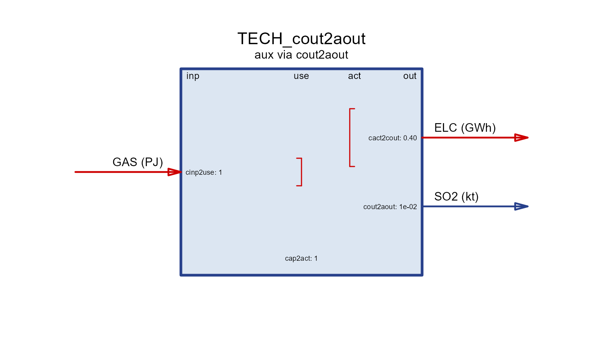

##### cinp2aout

Produced **per unit of input** commodity — e.g. fugitive `CH4` from the
fuel feed.

``` r

draw(aux_tech("cinp2aout", 0.001, "CH4", "kt"))
```


##### cap2aout

Produced **per unit of installed capacity** (e.g. land occupied while
the plant stands).

``` r

draw(aux_tech("cap2aout", 10, "LAND", "km2"))
```

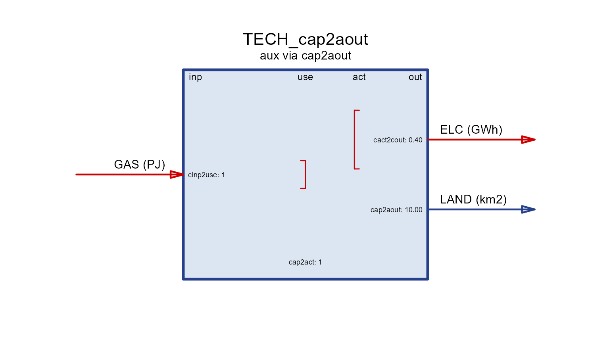

##### ncap2aout

Produced **per unit of new capacity** — one-off, e.g. construction-dust
`PM10`.

``` r

draw(aux_tech("ncap2aout", 0.5, "PM10", "kt"))
```


##### act2ainp

**Consumed per unit of activity** — e.g. cooling `WATER`.

``` r

draw(aux_tech("act2ainp", 0.1, "WATER", "Mm3"))
```


##### cap2ainp

**Consumed per unit of capacity** — a stock of `MAT`erial tied up in the
plant.

``` r

draw(aux_tech("cap2ainp", 4, "MAT", "kt"))
```

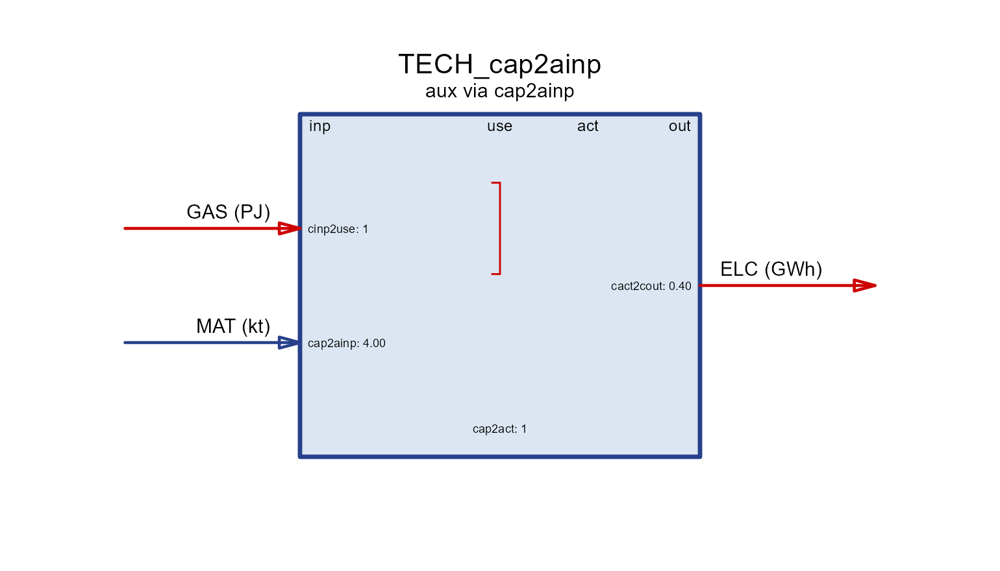

##### ncap2ainp

**Consumed per unit of new capacity** — `MAT`erials used to build (as in
the storage example above).

``` r

draw(aux_tech("ncap2ainp", 2, "MAT", "kt"))
```


### A full aux inventory

Real technologies carry several aux flows at once. A coal plant might
emit `NOx`, `SO2`, `CH4`, `PM10` and `PM25`, recover `HEAT` as a
by-product, and consume cooling `WATER` and construction `MAT`erials —
all in a single `aux`/`aeff` pair, each row filling only the driver
column that applies:

``` r

PLANT <- newTechnology(
  name = "PLANT", desc = "Coal plant with a full aux inventory",
  input  = data.frame(comm = "COA", unit = "PJ"),
  output = data.frame(comm = "ELC", unit = "GWh"),
  ceff = data.frame(comm = c("COA", "ELC"), cinp2use = c(1, NA), cact2cout = c(NA, 0.4)),
  aux  = data.frame(
    acomm = c("NOx", "SO2", "CH4", "PM10", "PM25", "HEAT", "WATER", "MAT"),
    unit  = c("kt",  "kt",  "kt",  "kt",   "kt",   "PJ",   "Mm3",   "kt")),
  aeff = data.frame(
    acomm     = c("NOx", "SO2", "CH4",  "PM10", "PM25", "HEAT", "WATER", "MAT"),
    act2aout  = c(0.20,  0.01,  0.001,  0.05,   0.03,   0.9,    NA,      NA),
    act2ainp  = c(NA,    NA,    NA,     NA,     NA,     NA,     0.1,     NA),
    ncap2ainp = c(NA,    NA,    NA,     NA,     NA,     NA,     NA,      2)))
draw(PLANT)
```

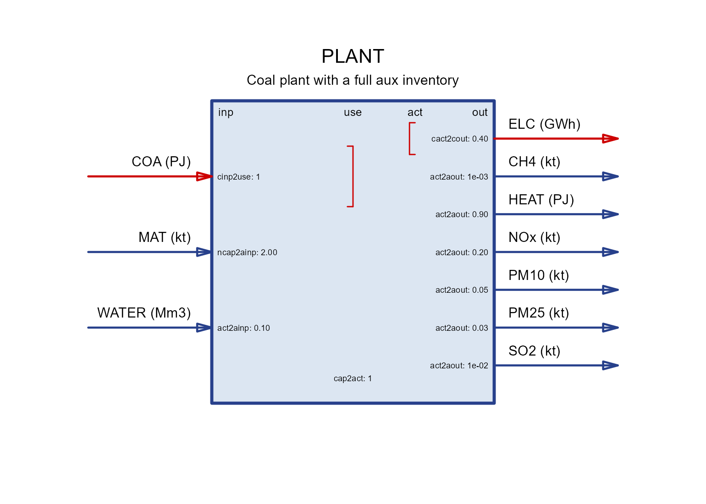

### Timeframe (operating frequency)

A technology operates at a **timeframe** — the level of the calendar it
is dispatched on. By default it is the **finest (highest-frequency)**
timeframe among the commodities it uses: a plant producing hourly `ELC`
runs hourly, while one producing only annual `STEEL` runs annually. Set
`timeframe =` to force a coarser level (e.g. run an electricity plant at
`"SEASON"` rather than `"HOUR"` to shrink the model).

``` r

newTechnology(
  name = "WIND", input = data.frame(comm = character()),
  output = data.frame(comm = "ELC", unit = "GWh"),
  timeframe = "HOUR")            # dispatch hourly (else inferred from commodities)
```

## User constraints

Beyond the physics baked into each process, you can add your own
**linear constraints** on the model variables.
[`newConstraint()`](https://energyRt.org/reference/newConstraint.md) is
the low-level form: you name the raw model variable, its dimension
(`for.each`), the relation (`eq`) and a right-hand side (`rhs`). A
classic use is an economy-wide **emission cap**:

``` r

CO2CAP <- newConstraint(
  name = "CO2CAP", desc = "Economy-wide CO2 cap", eq = "<=",
  for.each  = data.frame(year = c(2030, 2040, 2050), comm = "CO2"),
  emissions = list(variable = "vEmsFuelTot"),         # LHS term
  rhs       = data.frame(year = c(2030, 2050), rhs = c(5000, 2000)),
  defVal    = Inf)
CO2CAP@rhs        # the emission-cap path (interpolated over the horizon)
#>   year  rhs
#> 1 2030 5000
#> 2 2050 2000
```

[`newConstraintS()`](https://energyRt.org/reference/newConstraint.md) is
a higher-level shortcut: instead of naming variables you pass a semantic
`type` (`"capacity"`, `"newcapacity"`, `"inp"`, `"out"`, `"share"`,
`"growth"`, …) and a subset of processes, and it fills in the right
variables for you — for instance capping the total new capacity of a
technology:

``` r

# limit total new coal capacity across the horizon
COALLIM <- newConstraintS(
  name = "COALLIM", type = "newcapacity", eq = "<=",
  for.sum = list(tech = "PLANT"), rhs = 50)
```

## Structures

The bricks above are collected into three nested containers.

### Repository

A **repository** is an unordered bag of commodities and processes — the
reusable “parts library” you draw a model from. Pass objects straight to
[`newRepository()`](https://energyRt.org/reference/newRepository.md), or
`add()` them later.

``` r

repo <- newRepository("demo", COA, GAS, ELC, HEAT, CO2,
                      SUP_COA, DEM_ELC, IMP_GAS, BOILER)
repo <- add(repo, PLANT)          # add more parts later
names(repo)
#>  [1] "COA"     "GAS"     "ELC"     "HEAT"    "CO2"     "SUP_COA" "DEM_ELC"
#>  [8] "IMP_GAS" "BOILER"  "PLANT"
```

Members are reachable by name (`repo$BOILER`, `repo[["COA"]]`), and
[`length()`](https://rdrr.io/r/base/length.html) /
[`print()`](https://energyRt.org/reference/print.md) summarise the bag.

### Model

A **model** binds a repository to the dimensions it is solved over: a
`region` set, a `calendar` (the sub-annual structure — see the
[time-resolution
article](https://energyRt.org/articles/time-resolution.md)) and a
`horizon` (the milestone years). See the *autoplot* article for plots of
the calendar and horizon bricks.

``` r

mod <- newModel(
  name     = "demo",
  data     = repo,
  region   = "R1",
  calendar = calendars$season_dn,
  horizon  = newHorizon(period = 2020:2050, intervals = c(1, 10, 10, 10)))
mod
#> Name:  demo
```

### Scenario

A **scenario** is a model prepared for a specific solver run —
parameters interpolated onto the horizon, settings attached, and (after
solving) results stored.
[`interpolate_model()`](https://energyRt.org/reference/interpolate_model.md)
builds one without touching a solver; the actual optimisation is
[`solve_scenario()`](https://energyRt.org/reference/solve_model.md),
covered in the *solver backends* article.

``` r

scen <- interpolate_model(mod, name = "BASE")   # no solver needed
# scen <- solve_scenario(scen, solver = "GLPK") # the optimisation step
```

### Levelized cost

Once a technology sits in a container you can price its output with
[`levcost()`](https://energyRt.org/reference/levcost.md). Given a
**repository** or **model** and a technology name, it builds and solves
a tiny unit-demand model around that technology, drawing the related
commodities and supplies – and, from a model, the region / calendar /
discount – from the container. On a **solved scenario** it instead
reports the *realized* (ex-post) cost read from the solution.

``` r

levcost(mod,  name = "PLANT")                        # a-priori LCOE from the model
levcost(mod,  name = "PLANT", autocomplete = TRUE)   # if an input lacks a supply
levcost(scen, name = "PLANT")                        # ex-post cost (solved scenario)
report(scen,  name = "PLANT", format = "html")       # datasheet with cost embedded
```

By default [`levcost()`](https://energyRt.org/reference/levcost.md)
prices on an **annual** timeframe (a weather profile collapses to its
annual capacity factor, sizing capacity to serve demand at that factor);
pass `timeframe = "native"` to keep the model’s sub-annual calendar and
normalise by total generation. If an input commodity has no supply in
the container it returns `NULL` with a message unless
`autocomplete = TRUE` (or a `fuel_costs =` price) supplies it. See
*UTOPIA I* (a-priori screening across technologies) and *UTOPIA II*
(ex-post cost with `autoplot`) for worked numbers.

## See also

- **Autoplot** — plots of calendars, horizons, commodity emissions and
  the by-year `supply`/`demand`/`import`/`export` parameters.
- **Solver backends** — turning a scenario into a solved model.
- [`?draw`](https://energyRt.org/reference/draw.md),
  [`?newCommodity`](https://energyRt.org/reference/newCommodity.md),
  [`?newTechnology`](https://energyRt.org/reference/technology.md),
  [`?newConstraint`](https://energyRt.org/reference/newConstraint.md),
  [`?newRepository`](https://energyRt.org/reference/newRepository.md),
  [`?newModel`](https://energyRt.org/reference/newModel.md),
  [`?levcost`](https://energyRt.org/reference/levcost.md).
