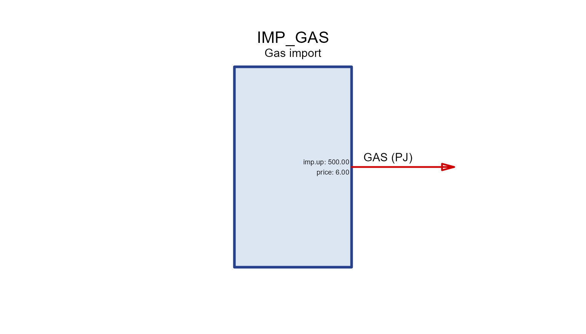
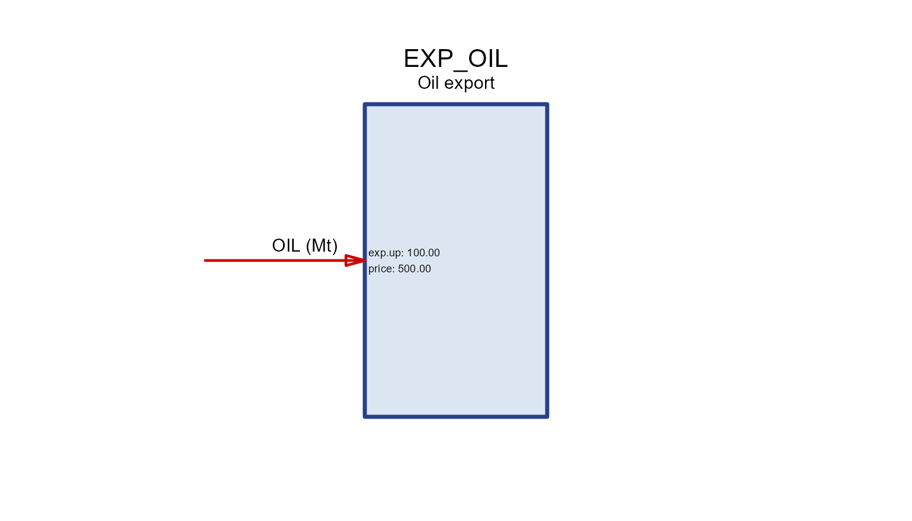
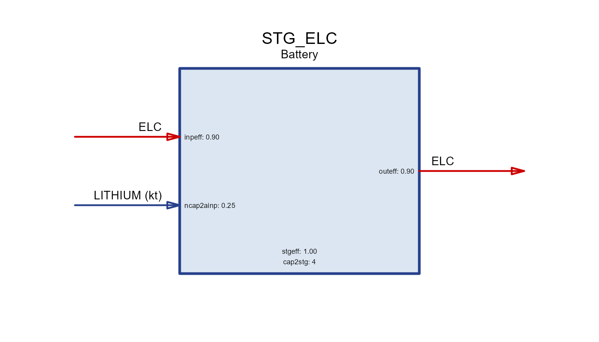
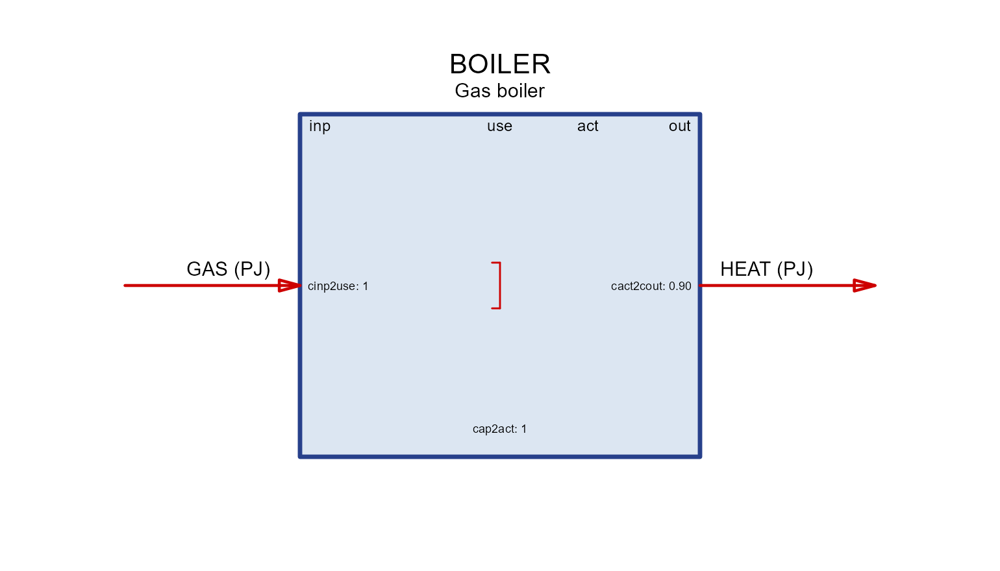
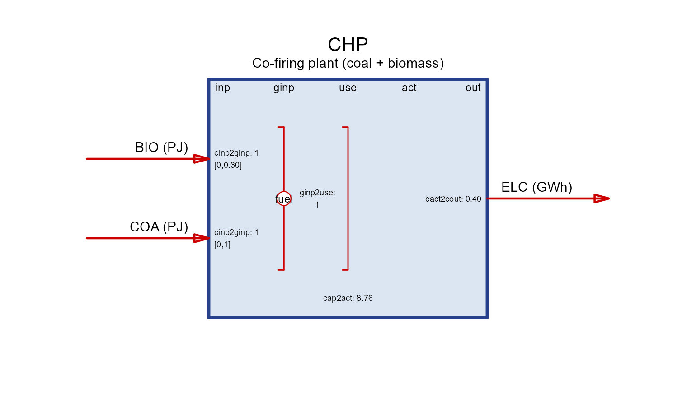
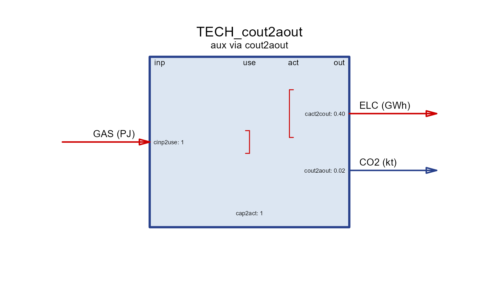
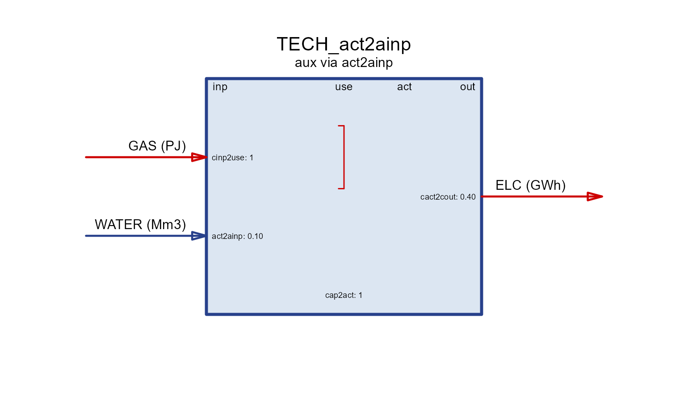
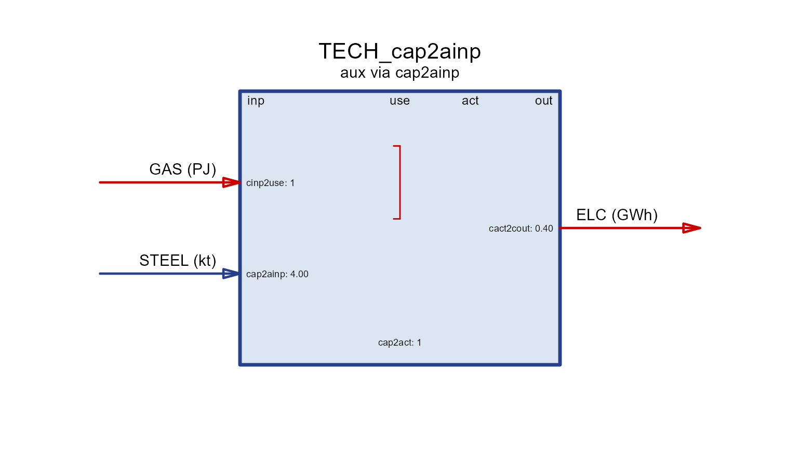
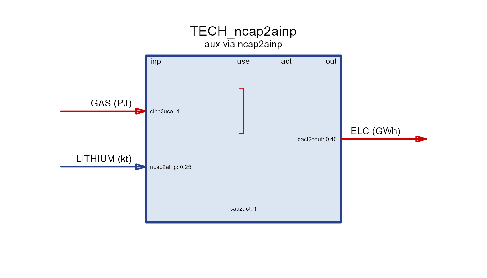

# Processes: technology, storage, trade, supply, demand, import, export

**Processes** are the model elements that move and convert commodities.
energyRt has seven of them, and every one has a
[`draw()`](https://energyRt.org/reference/draw.md) method that renders a
schematic of its inputs, outputs, auxiliary commodities and key
coefficients.

| Process | Role | Main commodity flow |
|----|----|----|
| `supply` | domestic source of a commodity | → out |
| `demand` | final consumption (a sink) | in → |
| `import` | purchase from the rest of the world | → out |
| `export` | sale to the rest of the world | in → |
| `trade` | move a commodity between regions | in ↔︎ out (per region) |
| `storage` | shift a commodity across time | in → 
``` math
store
```
 → out |
| `technology` | convert input commodities into outputs | in → **use → activity** → out |

``` r

library(energyRt)
```

## The process family

A one-line example and its diagram for each of the simpler processes.

### supply

A source of a commodity, with an availability bound and a cost (see the
*autoplot* article for the by-year view of the same data).

``` r

SUP_COA <- newSupply(
  name = "SUP_COA", desc = "Coal supply", commodity = "COA", unit = "PJ",
  reserve = data.frame(region = "R1", res.up = 2e5),
  availability = data.frame(region = "R1", year = NA_integer_, slice = "ANNUAL",
                            ava.up = 1e3, cost = 10))
draw(SUP_COA)
```


### demand

A commodity sink; `dem` is the demanded quantity over years/slices.

``` r

DEM_ELC <- newDemand(
  name = "DEM_ELC", desc = "Electricity demand", commodity = "ELC", unit = "GWh",
  dem = data.frame(region = "R1", year = c(2020, 2050), slice = "ANNUAL",
                   dem = c(100, 300)))
draw(DEM_ELC)
```


### import / export

Trade with the “rest of the world” at a `price`, bounded by `imp.*` /
`exp.*`.

``` r

IMP_GAS <- newImport(
  name = "IMP_GAS", desc = "Gas import", commodity = "GAS", unit = "PJ",
  imp = data.frame(region = "R1", year = c(2020, 2050), price = 6, imp.up = 500))
draw(IMP_GAS)
```



``` r


EXP_OIL <- newExport(
  name = "EXP_OIL", desc = "Oil export", commodity = "OIL", unit = "Mt",
  exp = data.frame(region = "R1", year = c(2020, 2050), price = 500, exp.up = 100))
draw(EXP_OIL)
```



### trade

Moves a commodity along `routes` (`src` → `dst`) between regions with a
transport efficiency `teff`.
[`draw()`](https://energyRt.org/reference/draw.md) shows the flows for
one node at a time.

``` r

PIPE <- newTrade(
  name = "PIPE", desc = "Gas pipeline", commodity = "GAS",
  routes = data.frame(src = c("R1", "R2"), dst = c("R2", "R3")),
  trade  = data.frame(src = c("R1", "R2"), dst = c("R2", "R3"), teff = c(0.97, 0.96)))
draw(PIPE, node = "R2")   # imports from R1, exports to R3
```


### storage

Shifts a commodity across time. `seff` holds the
charging/discharging/holding efficiencies (`inpeff`/`outeff`/`stgeff`)
and `cap2stg` is the storage duration.

``` r

STG_ELC <- newStorage(
  name = "STG_ELC", desc = "Battery", commodity = "ELC",
  seff = data.frame(inpeff = 0.9, outeff = 0.9, stgeff = 0.999),
  cap2stg = 4,                                   # 4 hours of storage per unit power
  aux  = data.frame(acomm = "LITHIUM", unit = "kt"),
  aeff = data.frame(acomm = "LITHIUM", ncap2ainp = 0.25))  # material per new capacity
draw(STG_ELC)
```



## Anatomy of a technology

A `technology` converts **input** commodities into **output**
commodities. Read its diagram left-to-right through four internal
stages:

       input(s)  ──▶  use  ──▶  activity  ──▶  output(s)
                 cinp2use   use2cact      cact2cout

- **`cinp2use`** — how much of a common *use* each unit of a commodity
  input provides (e.g. converting fuels to a common energy basis).
- **`use2cact`** — *use* to the technology’s **activity** (the central
  variable that all costs, availability and capacity are tied to).
- **`cact2cout`** — activity to each **output** commodity (efficiency /
  yield). All three default to `1`.

``` r

BOILER <- newTechnology(
  name = "BOILER", desc = "Gas boiler",
  input  = data.frame(comm = "GAS",  unit = "PJ"),
  output = data.frame(comm = "HEAT", unit = "PJ"),
  ceff = data.frame(comm = c("GAS", "HEAT"),
                    cinp2use  = c(1,  NA),
                    cact2cout = c(NA, 0.9)),   # 90% efficiency
  cap2act = 1)
draw(BOILER)
```



The four column headers in the box (`inp`, `use`, `act`, `out`) are
exactly these stages; each coefficient is printed next to the flow it
scales.

### Groups and shares

When several commodities are interchangeable on the input (or output)
side, put them in a **group**. A group is converted to *use* once (via
`ginp2use` in `geff`), and each member’s contribution is bounded by a
**share** (`share.lo`/`share.up`/`share.fx`). `cinp2ginp` converts each
commodity into the group’s common unit.

``` r

CHP <- newTechnology(
  name = "CHP", desc = "Co-firing plant (coal + biomass)",
  input = data.frame(comm = c("COA", "BIO"), group = "fuel", unit = "PJ"),
  output = data.frame(comm = "ELC", unit = "GWh"),
  group = data.frame(group = "fuel", desc = "Blended fuel", unit = "PJ"),
  geff  = data.frame(group = "fuel", ginp2use = 1),
  ceff  = data.frame(comm = c("COA", "BIO", "ELC"),
                    cinp2ginp = c(1, 1, NA),
                    cact2cout = c(NA, NA, 0.4),
                    share.up  = c(1.0, 0.3, NA)),   # at most 30% biomass
  cap2act = 8.76)
draw(CHP)
```



The share range is drawn in square brackets next to each grouped
commodity.

### Activity, capacity and units

Everything a technology does is measured by its **activity**. Installed
**capacity** limits the *maximum* activity through the scalar `cap2act`:

- `cap2act` — “how much product (activity, or output commodity if
  identical) is produced per unit of capacity”. For a power plant with
  capacity in `GW`, `cap2act = 8.76` gives a maximum activity of
  `8.76 GWh` per `GW` per year (8760 h, scaled to the cost/energy units
  in use).
- Capacity itself is bounded in the `capacity` slot: `stock`
  (pre-existing), `cap.lo/up/fx` (total), `ncap.lo/up/fx` (new builds)
  and `ret.lo/up/fx` (retirement). Availability factors `af`/`afs` bound
  activity within capacity.

#### Capacity in input vs. output units

Because capacity is tied to **activity**, whether it is expressed in
*input* or *output* units depends on where you place the efficiency.
Keep `cinp2use = 1` and put the loss on the output (`cact2cout = 0.9`)
and activity tracks the **input** — so capacity is in fuel-input units.
Move the efficiency to the input side instead and capacity becomes an
**output** rating:

``` r

# capacity rated on OUTPUT (e.g. a 1 GW_e turbine): activity == output
BOILER_out <- newTechnology(
  name = "BOILER_out", desc = "Boiler rated by heat output",
  input  = data.frame(comm = "GAS",  unit = "PJ"),
  output = data.frame(comm = "HEAT", unit = "PJ"),
  ceff = data.frame(comm = c("GAS", "HEAT"),
                    cinp2use  = c(1 / 0.9, NA),   # efficiency on the input side
                    cact2cout = c(NA, 1)),        # activity == heat output
  cap2act = 1)
draw(BOILER_out)
```


Both boilers have the same 90% efficiency; they differ only in what a
unit of capacity *means* (fuel input vs. heat output).

### Auxiliary commodities

**Auxiliary** commodities are extra flows tracked alongside the main
conversion — emissions, land, water, critical materials, by-products.
They are declared in `aux` and linked in `aeff` by a coefficient named
`<driver>2a<out|inp>`:

- the **driver** is what scales the flow: `cinp` (commodity input),
  `cout` (output), `act` (activity), `cap` (installed capacity), `ncap`
  (new capacity), or storage terms;
- `…2aout` **produces** the aux commodity (emissions, land,
  by-products); `…2ainp` **consumes** it (materials, energy).

Each tab isolates one driver on the same base technology (`GAS → ELC`).

``` r

aux_tech <- function(param, value, acomm = "AUX", unit = "unit") {
  aeff <- data.frame(acomm = acomm, stringsAsFactors = FALSE)
  aeff[[param]] <- value
  newTechnology(
    name = paste0("TECH_", param), desc = paste0("aux via ", param),
    input  = data.frame(comm = "GAS", unit = "PJ"),
    output = data.frame(comm = "ELC", unit = "GWh"),
    ceff   = data.frame(comm = c("GAS", "ELC"), cinp2use = c(1, NA), cact2cout = c(NA, 0.4)),
    aux    = data.frame(acomm = acomm, unit = unit),
    aeff   = aeff)
}
```

#### act2aout

Produced **per unit of activity** — the usual way to attach combustion
`CO2`.

``` r

draw(aux_tech("act2aout", 56, "CO2", "kt"))
```


#### cout2aout

Produced **per unit of output** commodity.

``` r

draw(aux_tech("cout2aout", 0.02, "CO2", "kt"))
```



#### cinp2aout

Produced **per unit of input** commodity (e.g. process emissions from a
feedstock).

``` r

draw(aux_tech("cinp2aout", 0.05, "CO2", "kt"))
```


#### cap2aout

Produced **per unit of installed capacity** (e.g. land occupied while
the plant stands).

``` r

draw(aux_tech("cap2aout", 10, "LAND", "km2"))
```


#### ncap2aout

Produced **per unit of new capacity** (one-off, e.g. construction
emissions).

``` r

draw(aux_tech("ncap2aout", 3, "CO2", "kt"))
```


#### act2ainp

**Consumed per unit of activity** (e.g. water or electricity used to
run).

``` r

draw(aux_tech("act2ainp", 0.1, "WATER", "Mm3"))
```



#### cap2ainp

**Consumed per unit of capacity** — a stock of material tied up in the
plant.

``` r

draw(aux_tech("cap2ainp", 4, "STEEL", "kt"))
```



#### ncap2ainp

**Consumed per unit of new capacity** — materials used to build
(e.g. lithium per GWh of battery, as in the storage example above).

``` r

draw(aux_tech("ncap2ainp", 0.25, "LITHIUM", "kt"))
```



### Timeframe (operating frequency)

A technology operates at a **timeframe** — the level of the calendar it
is dispatched on. By default it is the **finest (highest-frequency)**
timeframe among the commodities it uses: a plant producing hourly `ELC`
runs hourly, while one producing only annual `STEEL` runs annually. Set
`timeframe =` to force a coarser level (e.g. run an electricity plant at
`"SEASON"` rather than `"HOUR"` to shrink the model).

``` r

newTechnology(
  name = "WIND", input = data.frame(comm = character()),
  output = data.frame(comm = "ELC", unit = "GWh"),
  timeframe = "HOUR")            # dispatch hourly (else inferred from commodities)
```

## See also

- **Autoplot** — the by-year (`supply`/`demand`/`import`/`export`) plots
  of the same objects.
- [`?draw`](https://energyRt.org/reference/draw.md),
  [`?newTechnology`](https://energyRt.org/reference/technology.md),
  [`?newStorage`](https://energyRt.org/reference/storage.md),
  [`?newTrade`](https://energyRt.org/reference/newTrade.md).
- The **Utopia** and **Hello World** articles for these processes inside
  a full model.
