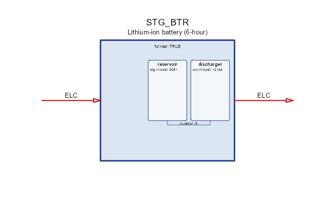
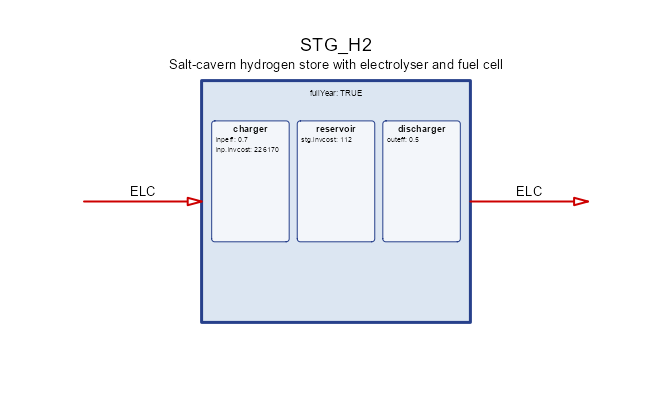
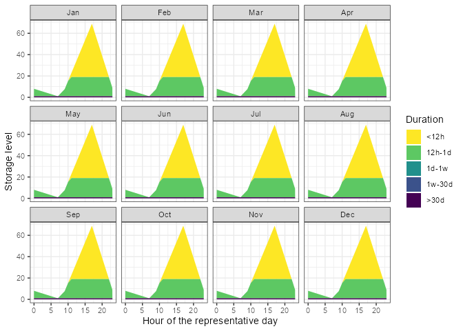
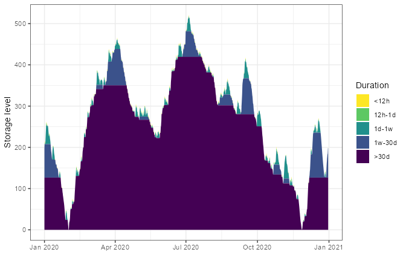

# Storage

``` r

library(energyRt)
library(ggplot2)
```

## What a storage is

Every other process in energyRt turns a flow into another flow *now*. A
`storage` is the only one that moves energy **between timeslices**: it
holds a level, and the level carries across the calendar.

That gives it three separate physical things, which for a long time
energyRt squeezed into one:

|                | what it is            | unit       | slot       |
|----------------|-----------------------|------------|------------|
| **charger**    | how fast it can fill  | power      | `@input`   |
| **reservoir**  | how much it can hold  | **energy** | `@storage` |
| **discharger** | how fast it can empty | power      | `@output`  |

A battery is an inverter plus a stack of cells. A pumped-hydro plant is
a pump, a reservoir and a turbine. An electric car is a charge point, a
battery and a motor. In each case the three are sized — and priced —
separately, and the interesting modelling questions are about the
*ratios* between them.

Declare the commodity first, with its unit, then the process:

``` r

ELC <- newCommodity(
  name      = "ELC",
  desc      = "Electricity",
  unit      = "MWh",
  timeframe = "HOUR"
)

STG_BTR <- newStorage(
  name      = "STG_BTR",
  desc      = "Lithium-ion battery (6-hour)",
  commodity = "ELC",
  output    = list(
    comm    = "ELC",
    unit    = "MWh",
    invcost = 12144                       # EUR/MW  -- the inverter
  ),
  storage   = list(
    comm    = "ELC",
    unit    = "MWh",
    invcost = 8081                        # EUR/MWh -- the cells
  ),
  duration  = 6,                          # a 6-hour battery
  vintage   = data.frame(olife = 15L)
)
draw(STG_BTR)
```



`commodity = "ELC"` is shorthand: it fills all three roles at once.
There is no `@commodity` slot — the argument is folded into `@input`,
`@storage` and `@output` when the object is built, so a storage never
carries two answers to “what does it consume”. Naming a role explicitly,
as `@output` and `@storage` are named above, overrides the shorthand for
that role only.

`unit` is descriptive: it is the unit of the **commodity** on that side,
carried for reporting and `convert()`, and never reaches the solver.
Capacity units are not declared — they follow from `cap2act`, which is
why the storing side has none.

## The three commodities need not be the same

This is the part that changes what you can model. `@storage$comm` is
what the store *holds*; `@input$comm` and `@output$comm` are what it
*exchanges*. When all three coincide you have a battery. When they do
not:

``` r

H2 <- newCommodity(
  name      = "H2",
  desc      = "Hydrogen",
  unit      = "MWh",
  timeframe = "HOUR"
)

STG_H2 <- newStorage(
  name      = "STG_H2",
  desc      = "Salt-cavern hydrogen store with electrolyser and fuel cell",
  commodity = "H2",                       # what it HOLDS
  input     = list(
    comm    = "ELC",                      # electrolyser
    unit    = "MWh",
    invcost = 226174
  ),
  output    = list(
    comm    = "ELC",                      # fuel cell
    unit    = "MWh"
  ),
  storage   = list(
    comm    = "H2",                       # the cavern
    unit    = "MWh",
    invcost = 112
  ),
  seff      = data.frame(
    inpeff  = 0.70,
    outeff  = 0.50
  ),
  vintage   = data.frame(olife = 25L)
)
draw(STG_H2)
```



`@seff$inpeff` and `$outeff` are **cross-commodity conversion factors**
here — input→stored and stored→output — the same role `cinp2use` plays
for a technology. When the three commodities coincide they are the
round-trip efficiencies they have always been, and nothing changes.

Before this, the same system needed an electrolyser, a store, a fuel
cell, and an artificial `H2` commodity whose only job was to join them.
On a two-day test model the fused object reproduces the decomposition’s
objective **exactly** (193.142857 on GLPK, Julia/HiGHS, Pyomo and GAMS
alike) in 149 variables and 151 constraints instead of 251 and 257.

The saving is structural rather than clever: the artificial commodity’s
balance rows disappear along with the two technologies.

An electric car is the case where this really bites. `ELC` is shared
with the grid, so a composed model needs an artificial on-board
commodity to stop the motor drawing from the mains while driving.
Disjoint availability profiles do not save you — the profile sits on the
*technology*, not on the commodity.

## The whole object at a glance

Everything a `storage` can carry, and where the rest of this article
covers it.

| slot | what it holds | section |
|----|----|----|
| `@name`, `@desc` | identity | above |
| `@input`, `@output`, `@storage` | the three parts: commodity, unit, capacity, cost | above, and *Sizing the parts* |
| `@duration`, `@inp2out` | ratios tying the parts together | *Sizing the parts* |
| `@fullYear` | where the cycle closes | *`@fullYear`* |
| `@startLevel` | endowment at the start of a cycle | *`@startLevel`* |
| `@seff` | storing / charging / discharging efficiency | *The three commodities*, *Losses* |
| `@af` | availability of the level and of the two flows | *Availability* |
| `@capacity` | whole-object stock, bounds and retirement | *Capacity, stock and retirement* |
| `@invcost`, `@fixom`, `@varom` | economics | *Costs* |
| `@aux`, `@aeff` | auxiliary commodities | *Auxiliary commodities* |
| `@weather` | weather-driven availability | *Weather* |
| `@region` | where it may be built | *Regions and variants* |
| `@cluster`, `@vintage` | variants of one object | *Regions and variants* |
| `@optimizeRetirement` | let the model retire early | *Capacity, stock and retirement* |
| `@misc` | anything else, untouched | — |

## `@fullYear`: where the cycle closes

The single most consequential flag on a storage, and the easiest to get
wrong.

- `fullYear = TRUE` (the default) — one cycle over the whole **year**.
  Energy put in during April can come out in October.
- `fullYear = FALSE` — one cycle **per parent timeframe**. On a day/hour
  calendar every day is an independent loop and nothing crosses
  midnight.

Cheap generation is unavailable on the February day, and all demand
falls there, so the store is the only cheap way to serve it — and only
if energy may cross the boundary between the two days.

``` r

# A bundled calendar: one representative day per month, 24 hours each. Its
# timeslices are DATED (`d015_h00`), which the reporting tools below need.
cal <- calendars$d365_h24_subset_1day_per_month
slices <- unique(cal@timetable$timeslice)
jan <- grep("^d015_", slices, value = TRUE)     # the January day
feb <- grep("^d046_", slices, value = TRUE)     # the February day

COA <- newCommodity(
  name      = "COA",
  desc      = "Steam coal",
  unit      = "MWh",
  timeframe = "ANNUAL"
)

SUP_COA <- newSupply(
  name      = "SUP_COA",
  desc      = "Coal supply",
  commodity = "COA",
  supply    = data.frame(cost = 1)
)

ECOA <- newTechnology(
  name    = "ECOA",
  desc    = "Cheap coal plant, unavailable on the February day",
  input   = list(comm = "COA", unit = "MWh"),
  output  = list(comm = "ELC", unit = "MWh"),
  invcost = data.frame(invcost = 10),
  af      = data.frame(timeslice = feb, af.up = 0),   # off in February
  vintage = data.frame(olife = 30L),
  cap2act = 1
)

EPEAK <- newTechnology(
  name    = "EPEAK",
  desc    = "Expensive peaking plant, always available",
  input   = list(comm = "COA", unit = "MWh"),
  output  = list(comm = "ELC", unit = "MWh"),
  invcost = data.frame(invcost = 5000),
  vintage = data.frame(olife = 30L),
  cap2act = 1
)

STG_YEAR <- newStorage(
  name      = "STG_YEAR",
  desc      = "Electricity store, one cycle over the whole year",
  commodity = "ELC",
  invcost   = list(invcost = 1),
  vintage   = data.frame(olife = 30L),
  fullYear  = TRUE
)

STG_DAY <- newStorage(
  name      = "STG_DAY",
  desc      = "The same store, but cycling once per day",
  commodity = "ELC",
  invcost   = list(invcost = 1),
  vintage   = data.frame(olife = 30L),
  fullYear  = FALSE
)

DEM_ELC <- newDemand(
  name      = "DEM_ELC",
  desc      = "Electricity demand, February day only",
  commodity = "ELC",
  demand    = data.frame(timeslice = feb, demand = 10)
)
```

The two stores are identical apart from `@fullYear`, so each gets its
own repository and model:

``` r

repo_year <- newRepository(
  name = "repo_year",
  COA, ELC, SUP_COA, ECOA, EPEAK, STG_YEAR, DEM_ELC
)

repo_day <- newRepository(
  name = "repo_day",
  COA, ELC, SUP_COA, ECOA, EPEAK, STG_DAY, DEM_ELC
)

mod_year <- newModel(
  name     = "fy_year",
  desc     = "Storage cycling over the year",
  region   = "R1",
  horizon  = newHorizon(2020),
  discount = 0,
  calendar = cal,
  repo     = repo_year
)

mod_day <- newModel(
  name     = "fy_day",
  desc     = "Storage cycling every day",
  region   = "R1",
  horizon  = newHorizon(2020),
  discount = 0,
  calendar = cal,
  repo     = repo_day
)

scen_year <- solve_model(mod_year, name = "fy_year")
#> Solver directory:  scenarios/fy-year_d365-h24-subset-1day-per-month/script/glpk 
#> Writing files: 0.3s
#> Starting  GLPK 
#> 0.15s
#> Reading solution: 0.1s
scen_day <- solve_model(mod_day, name = "fy_day")
#> Solver directory:  scenarios/fy-day_d365-h24-subset-1day-per-month/script/glpk 
#> Writing files: 0.3s
#> Starting  GLPK 
#> 0.12s
#> Reading solution: 0.08s

getData(scen_year, "vObjective", merge = TRUE)$value
#> [1] 9962.545
getData(scen_day, "vObjective", merge = TRUE)$value
#> [1] 14607300
```

With the cycle closed inside each day the store cannot help at all and
the model falls back on the expensive plant. The flag is not a detail.

`@fullYear` was **inert** before energyRt v0.80 — every storage cycled
within its parent timeframe whatever the flag said, which made multi-day
and seasonal storage silently unrepresentable. It surfaced when a
converted PyPSA-Eur battery came out 2.1x oversized and idle 6,624 hours
of 8,760.

## `@startLevel`: an endowment, once per cycle

`@startLevel` says how much is in the store at the *start of a cycle*.
It has no `timeslice` column on purpose: the slice is derived from where
the cycle closes, not chosen. It is an **annual** quantity, so a store
cycling daily receives its share, not the whole thing 365 times over.

``` r

STG_HYD <- newStorage(
  name       = "STG_HYD",
  desc       = "Reservoir hydro with an inherited initial filling",
  commodity  = "ELC",
  startLevel = data.frame(
    region     = "R1",
    year       = 2020L,
    startLevel = 500
  ),
  vintage    = data.frame(olife = 60L)
)
STG_HYD@startLevel
#>   vintage cluster region year startLevel
#> 1    <NA>    <NA>     R1 2020        500
```

## Sizing the parts

`@duration` and `@inp2out` are the two ratios that tie the three parts
together. Both are **bounds**, on `(storage, region, year)`:

    duration = reservoir / discharger   [hours]
    inp2out  = charger   / discharger   [dimensionless]

`duration = 6` fixes the ratio — a 6-hour battery. A range lets the
model choose:

``` r

STG_FLEX <- newStorage(
  name      = "STG_FLEX",
  desc      = "Battery whose energy-to-power ratio the model chooses",
  commodity = "ELC",
  output    = list(comm = "ELC", unit = "MWh", invcost = 12),
  storage   = list(comm = "ELC", unit = "MWh", invcost = 8),
  duration  = data.frame(
    duration.lo = 2,
    duration.up = 8
  ),
  vintage   = data.frame(olife = 15L)
)
STG_FLEX@duration
#>   vintage cluster region year duration duration.lo duration.up duration.fx
#> 1    <NA>    <NA>   <NA>   NA       NA           2           8          NA
```

A one-sided range opens the other side: `duration.up = 8` means “up to 8
hours” and does **not** quietly inherit a lower bound of 1.

An optimised ratio only means something when the reservoir is *priced* —
with energy free the model simply takes the longest duration allowed.
Given a cost on both sides, and both sides binding, it lands strictly
inside the range.

`@inp2out` works the same way for the charger. Leave it out and the
charger is sized with the discharger; give it a range and asymmetric
hardware — a fast charger with a slow fuel cell, or a pump smaller than
its turbine — becomes a decision rather than an assumption.

### Structure follows data

A part carrying only a commodity name gets **no capacity variable at
all**. Naming a commodity is metadata, not data; only a stock, a bound
or a price materialises `vStorageInpCap` / `vStorageStgCap`. Everywhere
else the ratio is inlined onto `vStorageOutCap`, which is exactly the
older, smaller model.

That is why adding all of this moved nothing: a storage written the old
way keeps one capacity variable and its previous LP, to the row.

| variable         | side       | unit       |
|------------------|------------|------------|
| `vStorageInpCap` | charger    | power      |
| `vStorageStgCap` | reservoir  | **energy** |
| `vStorageOutCap` | discharger | power      |

`vStorageCap` no longer exists. It meant *power*, and `vStorageStgCap`
means *energy* — one syllable apart. Rather than leave a name whose
meaning had to be guessed, it was renamed `vStorageOutCap`, so the old
name resolves to nothing instead of returning the wrong quantity. Use
`getData(scen, "vStorageOutCap")`.

### Rates and energy: `cap2act`

A charger is a **rate** — 7 kW is 7 kW whether you model the year in
hours or in four-hour blocks. A reservoir is an **amount** — 60 kWh is
60 kWh either way. energyRt keeps flows as quantities *within* a
timeslice, so the rate has to be converted at the bound:

    vStorageInp[.,s] <= cinp.up * cap2act * vStorageInpCap * pTimesliceShare[s]

`cap2act` is capacity → annual flow, exactly as on a `technology`. It
defaults to **8760**, the hours in a year, which makes a capacity read
as *commodity per hour* on any calendar:

| calendar   | share per slice | `8760 × share` |
|------------|----------------:|---------------:|
| 8760 × 1 h |          1/8760 |              1 |
| 2190 × 4 h |          4/8760 |              4 |
| 365 × 1 d  |           1/365 |             24 |
| 1 × annual |               1 |           8760 |

Write `cap.fx = 7` and you get 7 per hour in every row of that table. If
your commodity is TWh against GW capacity rather than GWh, use `8.76`.

### A calendar is a YEAR, so say which part of it you mean

`cap2act` only reads as “per hour” if a timeslice really is an hour, and
that is a property of the **calendar**, not of the storage. Declare 24
timeslices as a whole year and each is 365 hours long, so `cap.fx = 7`
quietly means 0.019 per hour.

The fix is not to adjust `cap2act` — that just renames the confusion. It
is to say the calendar covers one day *out of* the year:

``` r

YF  <- 1 / 365
cal <- newCalendar(
  timetable     = make_timetable(
    struct        = list(ANNUAL = "ANNUAL", HOUR = hrs),
    year_fraction = YF
  ),
  year_fraction = YF,
  name          = "one_day"
)
```

Each slice then has `share = 1/8760` — a real hour — and the timeslice
`weight` comes out as 365, so costs annualise as “this day, repeated all
year”. The bundled representative-day calendars work the same way, which
is why their leaf share is 1/8760 rather than 1/288.

Before this, the bound carried no share factor, so a capacity meant
“commodity per **timeslice**”. The same `cap.fx = 7` allowed 7 per hour
on a 24 × 1-hour calendar and 1.75 per hour on a 6 × 4-hour one — refine
the resolution and every store silently became weaker. `vStorageStgCap`
is deliberately **not** scaled: energy is energy.

This is also what makes `duration` honest. With the discharger a
per-hour rate and the reservoir an amount,
`duration = vStorageStgCap / vStorageOutCap` is an hour count — so
`duration = 6` on a 10 MW discharger gives exactly 60 MWh.

#### PyPSA does the same thing from the other end

PyPSA’s state-of-charge equation is

    soc[t] = (1-standing_loss)^eh · soc[t-1] + eff_store·eh·p_store − eh·p_dispatch/eff_dispatch

where `eh` is elapsed hours. Its `p_*` variables are **rates**, so no
limit constraint is scaled at all — neither `p ≤ p_nom` nor
`soc ≤ e_nom`. energyRt puts the conversion on the bound instead of in
the variable; the physics is identical. Note energyRt already agreed on
the decay term, which has always been
`(pStorageStgEff)^(pTimesliceShare)` — the same compounding by elapsed
time.

#### What aggregation still costs you

Making the rating resolution-independent does **not** make a coarse
calendar adequate. Discharge in a slice is bounded by three things:

    (1) out <= cout.up · cap2act · outCap · share[s]
    (2) out / outeff <= level[s]
    (3) level[s] <= af.up · stgCap

For a 6 h / 10 MW battery (60 MWh), only (1) changes with resolution:

| calendar  | flow bound (1) | energy bound (2)+(3) | binds      |
|-----------|---------------:|---------------------:|------------|
| hourly    |         10 MWh |               60 MWh | flow       |
| daily     |        240 MWh |               60 MWh | **energy** |
| day/night |     43,800 MWh |               60 MWh | **energy** |

So on coarse slices the power rating goes slack and the store is
governed by its energy capacity alone. Hence:

> The power rating binds only when the timeslice is **shorter than the
> storage’s discharge duration**.

Worse, the *cycle count* collapses. `N` timeslices allow at most `⌊N/2⌋`
cycles, so on a day/night calendar a 6-hour battery can perform exactly
**one** cycle a year — 60 MWh moved, against roughly 21,900 MWh for a
store that really cycles daily. On a single annual timeslice there is no
dynamic at all: the cyclic balance pairs the slice with itself and
collapses to `inpeff·inp = out/outeff`.

A store whose cycle is shorter than one timeslice is therefore
**understated, not approximated**. Representing ~365 daily cycles needs
on the order of 730 timeslices — sub-6-hourly resolution. That is a
property of temporal aggregation, not something the units fix can
recover.

## Losses: `@seff`

`@seff` carries all three efficiencies, and they are applied at
different places in the level equation:

| column   | applies to  | meaning                                          |
|----------|-------------|--------------------------------------------------|
| `inpeff` | charging    | fraction of the input that reaches the level     |
| `outeff` | discharging | level drawn per unit delivered is `1/outeff`     |
| `stgeff` | holding     | retention per hour, compounded as `stgeff^share` |

`stgeff` is the one to watch: it is a **rate**, raised to the timeslice
share, so `0.999` is a per-hour retention and not a per-timeslice one.
That is what keeps a self-discharge assumption stable when the calendar
is refined.

``` r

STG_BTR_LOSS <- newStorage(
  name      = "STG_BTR_LOSS",
  desc      = "Battery with round-trip and self-discharge losses",
  commodity = "ELC",
  duration  = 6,
  seff      = data.frame(
    inpeff = 0.95,
    outeff = 0.95,
    stgeff = 0.999
  ),
  vintage   = data.frame(olife = 15L)
)
STG_BTR_LOSS@seff
#>   vintage cluster region year timeslice stgeff inpeff outeff
#> 1    <NA>    <NA>   <NA>   NA      <NA>  0.999   0.95   0.95
```

Efficiencies may vary by `region`, `year` and `timeslice`, so a store
that ages or a cavern that leaks more in summer is a matter of extra
rows.

## Availability: `@af`

`@af` bounds the level and the two flows as fractions of their
capacities. Three families share the slot:

| columns                           | bounds                                  |
|-----------------------------------|-----------------------------------------|
| `af.lo` / `af.up` / `af.fx`       | the **level**, against `vStorageStgCap` |
| `cinp.lo` / `cinp.up` / `cinp.fx` | **charging**, against the charger       |
| `cout.lo` / `cout.up` / `cout.fx` | **discharging**, against the discharger |

Each accepts `region`, `year` and `timeslice`, so the bound can follow
the calendar. A reservoir kept above a minimum head, and a grid
connection that may not charge during the evening peak:

``` r

STG_RES <- newStorage(
  name      = "STG_RES",
  desc      = "Reservoir with a minimum head and a charging curfew",
  commodity = "ELC",
  storage   = list(comm = "ELC", unit = "MWh", invcost = 40),
  af        = data.frame(
    timeslice = c(NA, "d046_h18"),
    af.lo     = c(0.15, NA),              # never draw below 15% full
    cinp.up   = c(NA, 0)                  # no charging in that slice
  ),
  vintage   = data.frame(olife = 40L)
)
STG_RES@af
#>   vintage cluster region year timeslice af.lo af.up af.fx cinp.up cinp.fx
#> 1    <NA>    <NA>   <NA>   NA      <NA>  0.15    NA    NA      NA      NA
#> 2    <NA>    <NA>   <NA>   NA  d046_h18    NA    NA    NA       0      NA
#>   cinp.lo cout.up cout.fx cout.lo
#> 1      NA      NA      NA      NA
#> 2      NA      NA      NA      NA
```

`NA` in a key column means “every member of it”, so the first row
applies in every timeslice and the second only in the named one. `.fx`
overrides the matching `.lo`/`.up` pair.

## Capacity, stock and retirement

`@capacity` describes the object as a whole, in the same shape a
`technology` uses: existing `stock`, bounds on total capacity (`cap.*`),
bounds on new builds (`ncap.*`), and bounds on retirement (`ret.*`).
Per-part capacity lives on `@input` / `@output` / `@storage`;
`@capacity` is the place for what is true of the storage itself.

``` r

STG_FLEET <- newStorage(
  name      = "STG_FLEET",
  desc      = "Existing battery fleet with a build limit",
  commodity = "ELC",
  capacity  = data.frame(
    region  = "R1",
    year    = 2020L,
    stock   = 120,                        # already built
    ncap.up = 50                          # at most 50 more in this year
  ),
  vintage   = data.frame(olife = 15L)
)
STG_FLEET@capacity
#>   vintage cluster region year stock cap.lo cap.up cap.fx ncap.lo ncap.up
#> 1    <NA>    <NA>     R1 2020   120     NA     NA     NA      NA      50
#>   ncap.fx ret.lo ret.up ret.fx
#> 1      NA     NA     NA     NA
```

`@optimizeRetirement = TRUE` lets the model retire capacity before its
operational life ends — worth it when a store is cheap to build and
expensive to keep. It only takes effect when the model or scenario also
enables it, so the flag on the object is a permission rather than an
instruction.

## Costs: `@invcost`, `@fixom`, `@varom`

Three slots, on the three things you can spend money on:

| slot | charged on | key columns |
|----|----|----|
| `@invcost` | new capacity | `invcost`, `wacc`, `payback`, `eac`, `retcost` |
| `@fixom` | installed capacity, per year | `fixom` |
| `@varom` | flows and level, per timeslice | `inpcost`, `outcost`, `stgcost` |

`@invcost` and `@fixom` on the *object* price the whole store; the same
names inside `@input` / `@output` / `@storage` price one part, which is
what the battery at the top of this article does. `@varom` splits by
what is charged: `inpcost` per unit charged, `outcost` per unit
discharged, `stgcost` per unit held.

``` r

STG_PRICED <- newStorage(
  name      = "STG_PRICED",
  desc      = "Battery priced on capacity and on every unit moved",
  commodity = "ELC",
  duration  = 6,
  invcost   = data.frame(invcost = 8081), # EUR/MWh on new capacity
  fixom     = data.frame(fixom = 5),      # EUR/MW/yr on the whole store
  varom     = data.frame(
    inpcost = 0.5,
    outcost = 0.5
  ),
  vintage   = data.frame(olife = 15L)
)
STG_PRICED@varom
#>   vintage cluster region year timeslice inpcost outcost stgcost
#> 1    <NA>    <NA>   <NA>   NA      <NA>     0.5     0.5      NA
```

`wacc`, `payback` and `eac` behave exactly as on a `technology`: see the
[technology](https://energyRt.org/articles/model-bricks.md) article
rather than a second copy here.

## Auxiliary commodities: `@aux` and `@aeff`

An auxiliary commodity is anything the store consumes or produces that
is not one of its three roles — lithium for the cells, water for a
reservoir, land. `@aux` declares the commodity and its unit; `@aeff`
says what it is proportional to.

The `@aeff` column names read *source*`2`*target*, so `ncap2ainp` is
auxiliary input per unit of **new** capacity, and `cout2aout` is
auxiliary output per unit discharged:

| column                    | auxiliary flow driven by             |
|---------------------------|--------------------------------------|
| `ncap2ainp` / `ncap2aout` | new capacity (a build-time material) |
| `cap2ainp` / `cap2aout`   | installed capacity (something held)  |
| `cinp2ainp` / `cinp2aout` | charging                             |
| `cout2ainp` / `cout2aout` | discharging                          |
| `stg2ainp` / `stg2aout`   | the level itself                     |
| `ncap2stg`                | new capacity, on the storing side    |

``` r

MAT <- newCommodity(
  name = "MAT",
  desc = "Battery-grade lithium",
  unit = "kt"
)

STG_MAT <- newStorage(
  name      = "STG_MAT",
  desc      = "Battery that consumes lithium when it is built",
  commodity = "ELC",
  duration  = 6,
  aux       = data.frame(
    acomm = "MAT",
    unit  = "kt"
  ),
  aeff      = data.frame(
    acomm     = "MAT",
    ncap2ainp = 0.25                      # kt of lithium per MW built
  ),
  vintage   = data.frame(olife = 15L)
)
STG_MAT@aeff[, c("acomm", "ncap2ainp")]
#>   acomm ncap2ainp
#> 1   MAT      0.25
```

## Weather

`@weather` multiplies availability by a named `weather` object, so an
inflow series or an ambient-temperature derating drives the bounds. The
coefficients mirror `@af`: `waf.*` scales the level bound, `wcinp.*`
charging and `wcout.*` discharging.

``` r

STG_HYD_W <- newStorage(
  name      = "STG_HYD_W",
  desc      = "Reservoir hydro driven by an inflow series",
  commodity = "ELC",
  weather   = data.frame(
    weather  = "WHYD",                    # a newWeather() object in the repo
    wcinp.fx = 1                          # inflow drives charging
  ),
  vintage   = data.frame(olife = 60L)
)
```

The weather object itself must be in the same repository. Availability,
not capacity, is what weather scales — a dry year does not shrink the
reservoir.

Several weather factors may act on the same bound — they multiply, on
every backend. Verified across GLPK and Julia/HiGHS on a two-factor
process, which agree on the objective to ten digits.

## Regions and variants

`@region` restricts where the storage may be built — leave it empty and
it is available everywhere in the model.

`@cluster` and `@vintage` turn one object into several. A **vintage** is
a build period with its own lifetime and costs; a **cluster** is a
parallel variant, such as a resource grade. Both are declared once and
then referenced from the `vintage` / `cluster` column that nearly every
other slot carries, which is how a 2020 battery and a 2050 battery can
differ in cost without becoming two objects.

``` r

STG_VINT <- newStorage(
  name      = "STG_VINT",
  desc      = "Battery with two build vintages",
  commodity = "ELC",
  region    = "R1",
  vintage   = data.frame(
    vintage = c("v2020", "v2050"),
    start   = c(2020L, 2050L),
    end     = c(2049L, 2100L),
    olife   = c(12L, 20L)
  ),
  storage   = list(
    comm    = c("ELC", "ELC"),
    unit    = c("MWh", "MWh"),
    vintage = c("v2020", "v2050"),
    invcost = c(8081, 3200)               # cells get cheaper
  )
)
STG_VINT@vintage
#>   vintage region cluster start  end olife
#> 1   v2020   <NA>    <NA>  2020 2049    12
#> 2   v2050   <NA>    <NA>  2050 2100    20
STG_VINT@storage[, c("comm", "vintage", "invcost")]
#>   comm vintage invcost
#> 1  ELC   v2020    8081
#> 2  ELC   v2050    3200
```

Every slot that carries a `vintage` (or `cluster`) column can be split
this way, so the two vintages differ only where you say they do. See the
[variants](https://energyRt.org/articles/model-bricks.md) material for
how the two interact.

## Reading the result: `storage_duration()`

A level series tells you how full the store is. It does not tell you the
thing that decides what technology you need: how much of that energy is
cycling within a few hours, and how much is sitting there for weeks.

[`storage_duration()`](https://energyRt.org/reference/storage_duration.md)
splits the level into duration bands by nested **floors**. For a window
of `w` hours, the floor is the energy that never leaves the store across
some `w`-hour stretch — energy committed for at least that long. Floors
are nested, so successive differences partition the level with no
overlap and no remainder: **the bands sum back to `vStorageLevel`
exactly.**

A solar-plus-battery system on the same bundled calendar gives it
something to decompose: generation only in the middle of the day, demand
in the evening.

``` r

hr <- as.integer(sub(".*_h", "", slices))

SOL <- newCommodity(
  name      = "SOL",
  desc      = "Solar irradiation",
  unit      = "MWh",
  timeframe = "HOUR"
)

SUP_SOL <- newSupply(
  name      = "SUP_SOL",
  desc      = "Solar resource, daylight hours only",
  commodity = "SOL",
  supply    = data.frame(
    timeslice = slices,
    cost      = 0,
    ava.up    = ifelse(hr >= 8 & hr <= 16, 100, 0)
  )
)

ESOL <- newTechnology(
  name    = "ESOL",
  desc    = "Solar PV",
  input   = list(comm = "SOL", unit = "MWh"),
  output  = list(comm = "ELC", unit = "MWh"),
  invcost = data.frame(invcost = 10),
  vintage = data.frame(olife = 30L),
  cap2act = 8760
)

DEM_EVE <- newDemand(
  name      = "DEM_EVE",
  desc      = "Evening-peaked electricity demand",
  commodity = "ELC",
  demand    = data.frame(
    timeslice = slices,
    demand    = ifelse(hr >= 17 & hr <= 22, 10, 1)
  )
)

STG_BTR_SOL <- newStorage(
  name      = "STG_BTR_SOL",
  desc      = "Battery paired with the solar plant",
  commodity = "ELC",
  invcost   = list(invcost = 1),
  vintage   = data.frame(olife = 30L),
  fullYear  = TRUE
)

repo_sol <- newRepository(
  name = "repo_sol",
  SOL, ELC, SUP_SOL, ESOL, EPEAK, STG_BTR_SOL, DEM_EVE
)

sol_mod <- newModel(
  name     = "solar_battery",
  desc     = "Solar plus a battery on one day per month",
  region   = "R1",
  horizon  = newHorizon(2020),
  discount = 0,
  calendar = cal,
  repo     = repo_sol
)

scen <- solve_model(sol_mod, name = "solar_battery")
#> Solver directory:  scenarios/solar-battery_d365-h24-subset-1day-per-month/script/glpk 
#> Writing files: 0.2s
#> Starting  GLPK 
#> 0.25s
#> Reading solution: 0.08s
```

``` r

d <- storage_duration(scen)                 # 12h / 1d / 1w / 30d by default

# One panel per representative day: this calendar's days are a month apart, so
# plotting them on one continuous axis would draw lines across gaps that are not
# in the model.
d$day <- format(d$datetime, "%b")
d$hour <- as.integer(format(d$datetime, "%H"))
ggplot(d, aes(hour, value, fill = duration)) +
  geom_area() +
  facet_wrap(~factor(day, levels = unique(d$day))) +
  scale_fill_viridis_d(direction = -1, name = "Duration") +
  labs(x = "Hour of the representative day", y = "Storage level") +
  theme_bw()
```



Every band here is short: a day-per-month calendar has no way to
represent energy held from spring to autumn, so the long bands can only
show as a flat floor. A genuinely seasonal split needs a contiguous
full-year calendar.

### A full year, on measured wind and solar

`vre_cf` is a year of hourly capacity factors for one wind and one solar
resource, derived from the MERRA-2 reanalysis. Its `slice` column is
already in the `d365_h24` vocabulary, so it drops onto the bundled
hourly calendar:

``` r

str(vre_cf)
#> 'data.frame':    8760 obs. of  3 variables:
#>  $ slice: chr  "d001_h00" "d001_h01" "d001_h02" "d001_h03" ...
#>  $ solar: num  0 0 0 0 0 0 0 0 0.002 0.013 ...
#>  $ wind : num  0.995 0.966 0.89 0.84 0.81 ...
colMeans(vre_cf[, c("solar", "wind")])
#>     solar      wind 
#> 0.1256643 0.2488839
```

The model is deliberately spare: two weather-driven plants, a gas
backstop, a cheap store and a **constant** demand. With demand flat,
everything the store does is forced by the resource rather than by the
load.

``` r

cal <- calendars$d365_h24

# The capacity factor belongs on the TECHNOLOGY, as an hourly availability
# bound. Putting it on a supply's `ava.up` instead caps the resource in
# absolute terms, so the plant can never be built larger than one unit however
# cheap it is, and the backstop quietly covers the rest.
ESOL <- newTechnology(
  name    = "ESOL",
  desc    = "Solar PV",
  output  = list(comm = "ELC", unit = "MWh"),
  af      = data.frame(timeslice = vre_cf$slice, af.up = vre_cf$solar),
  invcost = data.frame(invcost = 700),
  vintage = data.frame(olife = 25L),
  cap2act = 8760
)

EWIN <- newTechnology(
  name    = "EWIN",
  desc    = "Wind turbine",
  output  = list(comm = "ELC", unit = "MWh"),
  af      = data.frame(timeslice = vre_cf$slice, af.up = vre_cf$wind),
  invcost = data.frame(invcost = 1300),
  vintage = data.frame(olife = 25L),
  cap2act = 8760
)

# Cheap, and its ENERGY far cheaper than its power, so the model would rather
# keep a surplus than spill it. Price the store highly and the optimum is
# simply to curtail: the level never carries, and every band above a day comes
# out empty.
STG_BTR_VRE <- newStorage(
  name      = "STG_BTR_VRE",
  desc      = "Cheap store, energy and power sized separately",
  commodity = "ELC",
  output    = list(comm = "ELC", unit = "MWh", invcost = 20),  # power, per MW
  storage   = list(comm = "ELC", unit = "MWh", invcost = 1),   # energy, per MWh
  seff      = data.frame(inpeff = 0.95, outeff = 0.95),
  vintage   = data.frame(olife = 15L),
  fullYear  = TRUE
)

DEM_VRE <- newDemand(
  name      = "DEM_VRE",
  desc      = "Constant electricity demand",
  commodity = "ELC",
  demand    = data.frame(timeslice = vre_cf$slice, demand = 1)
)

# ... plus the ELC and GAS commodities, SUP_GAS and the EPEAK backstop;
# the whole script is data-raw/vre_storage_duration.R

scen_vre <- solve_model(mod_vre, solver = solver_options$julia_highs)
vre_storage_duration <- storage_duration(scen_vre)
```

The answer is a system with **no gas built at all**: 2.4 units of solar
and 3.0 of wind generate 9064 against a demand of 8760, the 3.5% gap
being the store’s round-trip loss rather than spilled energy. To do that
it buys a 520 MWh store — three weeks of demand — and runs it as a
season-length reservoir.

Solve that one on **julia/HiGHS**, not GLPK — at 8760 timeslices the
difference is minutes, which is why the result is precomputed and
shipped as `vre_storage_duration` rather than solved while this page
builds.

``` r

ggplot(vre_storage_duration, aes(datetime, value, fill = duration)) +
  geom_area() +
  scale_fill_viridis_d(direction = -1, name = "Duration") +
  labs(x = NULL, y = "Storage level") +
  theme_bw()
```



Now the split is worth reading. The store is not one thing doing one
job: a thin band cycles within the day, while most of the energy is
committed for **more than thirty days** — charged when wind and sun are
abundant and released a season later.

``` r

tapply(vre_storage_duration$value, vre_storage_duration$duration, sum)
#>        <12h      12h-1d       1d-1w      1w-30d        >30d 
#>    3848.461    6035.640   56860.498  173581.134 2141880.391
```

Those long bands are exactly what a coarse calendar cannot see. Reading
them off a model with `@fullYear = FALSE`, or with timeslices longer
than the cycle you care about, would return near-zero — not because the
storage is short-duration, but because the model was never able to say
otherwise.

Change the bands with `width` (in hours) and name them with `labels`. A
store that cycles within its parent timeframe cannot hold energy longer
than that cycle, so its long bands come out near zero — a property of
the model, not a failure of the split.

Despite its name in the original IDEEA script, this is not a moving
average. An average would blur the bands into each other and would not
sum back to the level.

## See also

- [Time resolution](https://energyRt.org/articles/time-resolution.md) —
  calendars, timeslices, and what `@fullYear` is relative to.
- [Model bricks](https://energyRt.org/articles/model-bricks.md) — how
  `storage` sits beside `technology`, `supply` and `demand`.
