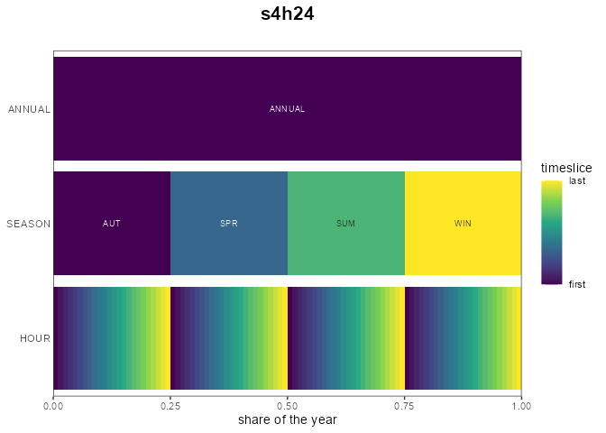

# Time resolution: calendars and slices

``` r

library(energyRt)
library(ggplot2)
```

## Why sub-annual time matters

Annual averages hide what makes energy systems hard: the sun sets, wind
stalls, demand peaks in the evening. A model that balances electricity
once a year sees none of it — storage is pointless, solar looks
dispatchable, peak capacity is free. A **calendar** gives the model
sub-annual **time slices**, and the slice count is the main dial between
realism and model size:

| calendar         | structure                  | slices |
|------------------|----------------------------|-------:|
| `utopia_annual`  | one annual slice           |      1 |
| `utopia_seasons` | 4 seasons × day/night/peak |     12 |
| `utopia_s4h24`   | 4 seasons × 24 hours       |     96 |
| `utopia_m12h24`  | 12 months × 24 hours       |    288 |
| `d365`           | 365 days                   |    365 |

Model variables scale roughly linearly with slices — the 96-slice UTOPIA
base case solves in seconds on GLPK, the 288-slice variant is noticeably
heavier.

## The `make_timetable()` grammar

A calendar’s structure is a **nested named list**: each element is a
*level* (e.g. `SEASON`, `HOUR`), holding its *slices*. Slice names must
be alphanumeric (they become set elements in the solver files). The
simplest form lists slice names — the year is divided equally:

``` r

tt <- make_timetable(list(
  SEASON = c("WIN", "SPR", "SUM", "AUT"),
  HOUR   = paste0("h", formatC(0:23, width = 2, flag = "0"))
))
head(tt)          # 4 x 24 = 96 leaf slices, equal shares
#>    ANNUAL SEASON   HOUR   slice      share weight
#>    <char> <char> <char>  <char>      <num>  <num>
#> 1: ANNUAL    AUT    h00 AUT_h00 0.01041667      1
#> 2: ANNUAL    AUT    h01 AUT_h01 0.01041667      1
#> 3: ANNUAL    AUT    h02 AUT_h02 0.01041667      1
#> 4: ANNUAL    AUT    h03 AUT_h03 0.01041667      1
#> 5: ANNUAL    AUT    h04 AUT_h04 0.01041667      1
#> 6: ANNUAL    AUT    h05 AUT_h05 0.01041667      1
```

Unequal **shares** are given per slice; a nested
`list(<share>, <LEVEL> = ...)` attaches child levels. UTOPIA’s 12-slice
calendar makes peak hours short and winter nights long:

``` r

tt12 <- make_timetable(list(
  SEASON = list(
    WIN = list(1 / 4, HOUR = list(DAY =  9 / 24, NGT = 12 / 24, PK = 3 / 24)),
    SPR = list(1 / 4, HOUR = list(DAY = 11 / 24, NGT = 11 / 24, PK = 2 / 24)),
    SUM = list(1 / 4, HOUR = list(DAY = 12 / 24, NGT =  9 / 24, PK = 3 / 24)),
    AUT = list(1 / 4, HOUR = list(DAY = 11 / 24, NGT = 11 / 24, PK = 2 / 24))
  )
))
head(tt12)
#>    ANNUAL SEASON   HOUR   slice      share weight
#>    <char> <char> <char>  <char>      <num>  <num>
#> 1: ANNUAL    AUT    DAY AUT_DAY 0.11458333      1
#> 2: ANNUAL    AUT    NGT AUT_NGT 0.11458333      1
#> 3: ANNUAL    AUT     PK  AUT_PK 0.02083333      1
#> 4: ANNUAL    SPR    DAY SPR_DAY 0.11458333      1
#> 5: ANNUAL    SPR    NGT SPR_NGT 0.11458333      1
#> 6: ANNUAL    SPR     PK  SPR_PK 0.02083333      1
```

## From timetable to calendar

[`newCalendar()`](https://energyRt.org/reference/newCalendar.md) turns a
timetable into a `calendar` object. Note that `name` is the *first*
argument — always pass the timetable by name (`timetable =`), or name
`name`/`desc` so the timetable lands in the right slot:

``` r

cal <- newCalendar(timetable = tt, name = "s4h24")
cal@name
#> [1] "s4h24"
nrow(cal@slice_share)          # slices with their share of the year
#> [1] 101
head(as.data.frame(cal@slice_share), 3)
#>    slice share weight
#> 1 ANNUAL  1.00      1
#> 2    AUT  0.25      1
#> 3    SPR  0.25      1
cal@timeframe_rank             # levels, coarsest (ANNUAL) to finest
#> ANNUAL SEASON   HOUR 
#>      1      2      3
```

The derived slots do the bookkeeping the model needs:

- **`@slice_share`** — each slice’s share of the year (the weight used
  whenever slice values are aggregated);
- **`@timeframes`** — the slice sets at every level (`ANNUAL`, `SEASON`,
  …);
- **`@timeframe_rank`** — the level hierarchy; a commodity’s `timeframe`
  picks the level it is balanced on.

[`autoplot()`](https://ggplot2.tidyverse.org/reference/autoplot.html)
draws the nested structure:

``` r

autoplot(cal)
```



## Ready-made calendars

The package ships a `calendars` list, built by `data-raw/calendars.R`
with exactly the grammar above — including the whole UTOPIA family:

``` r

names(calendars)
#> [1] "season_dn"                      "d365"                          
#> [3] "utopia_annual"                  "utopia_seasons"                
#> [5] "utopia_s4h24"                   "utopia_m12h24"                 
#> [7] "d365_h24"                       "d365_h24_subset_1day_per_month"
calendars$utopia_seasons@desc
#> [1] "UTOPIA: 4 seasons x 3 dayparts (DAY/NIGHT/PEAK), 12 slices"
```

Pick one and pass it to `newModel(calendar = ...)`; the UTOPIA vignettes
use `calendars$utopia_s4h24` throughout.

## Slice-string helpers

Slice names encode time; a few helpers translate between encodings:

``` r

hour2HOUR(c(0, 13, 23))        # hour of day -> "h00" "h13" "h23"
#> [1] "h00" "h13" "h23"
yday2YDAY(c(1, 365))           # day of year -> "d001" "d365"
#> [1] "d001" "d365"
head(tsl_formats)              # known slice-name formats (a dataset)
#> [1] "d364"     "d365"     "d366"     "d364_h24" "d365_h24" "d366_h24"
```

[`tsl2dtm()`](https://energyRt.org/reference/timeslices.md) /
[`dtm2tsl()`](https://energyRt.org/reference/timeslices.md) convert
slice strings to/from date-times — useful when joining model output with
observed hourly data.

## Timeframes: commodities and processes

Every commodity carries a `timeframe` — the calendar level it is
**balanced** on. Fuels are typically `ANNUAL`; electricity `HOUR`:

``` r

ELC <- newCommodity("ELC", timeframe = "HOUR")    # balanced every slice
COA <- newCommodity("COA", timeframe = "ANNUAL")  # balanced once a year
```

A process operates at the *finest* timeframe among its commodities (a
gas plant producing hourly `ELC` is dispatched hourly), overridable via
`newTechnology(timeframe = ...)` — see the [model bricks
article](https://energyRt.org/articles/model-bricks.md) for details. The
practical consequence: raising the calendar’s resolution refines *only*
the commodities and processes whose timeframes follow it — annual
bookkeeping stays cheap.

## Choosing a resolution

- Start coarse (`utopia_seasons`-like, ~12 slices) while the model
  structure is in flux — solves are instant.
- Move to hour-within-season (`utopia_s4h24`, 96) once storage, VRE
  profiles or peak pricing matter — intra-day dynamics need real hours.
- Full-year hourly detail (`utopia_m12h24`, 288 or `d365`+hours) is for
  final runs; check tractability with
  [`model_size()`](https://energyRt.org/reference/model_size.md) first.

The [UTOPIA vignettes](https://energyRt.org/articles/utopia-build.md)
build one model and run it on these calendars interchangeably —
resolution is a configuration choice, not a rewrite.
