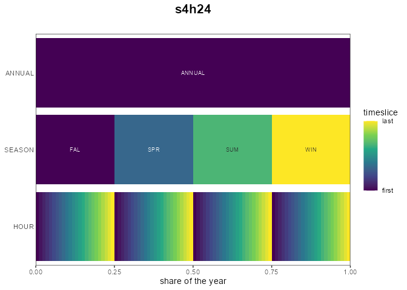

# Time resolution: calendars and timeslices

``` r

library(energyRt)
library(ggplot2)
```

## Why sub-annual time matters

Annual averages hide what makes energy systems hard: the sun sets, wind
stalls, demand peaks in the evening. A model that balances electricity
once a year sees none of it — storage is pointless, solar looks
dispatchable, peak capacity is free. A **calendar** gives the model
sub-annual **time timeslices**, and the timeslice count is the main dial
between realism and model size:

| calendar         | structure                  | timeslices |
|------------------|----------------------------|-----------:|
| `annual`         | one annual timeslice       |          1 |
| `utopia_seasons` | 4 seasons × day/night/peak |         12 |
| `s4_h24`         | 4 seasons × 24 hours       |         96 |
| `m12_h24`        | 12 months × 24 hours       |        288 |
| `d365`           | 365 days                   |        365 |

Model variables scale roughly linearly with timeslices — the
96-timeslice UTOPIA base case solves in seconds on GLPK, the
288-timeslice variant is noticeably heavier.

## The `make_timetable()` grammar

A calendar’s structure is a **nested named list**: each element is a
*level* (e.g. `SEASON`, `HOUR`), holding its *timeslices*. Timeslice
names must be alphanumeric (they become set elements in the solver
files). The simplest form lists timeslice names — the year is divided
equally:

``` r

tt <- make_timetable(list(
  SEASON = c("WIN", "SPR", "SUM", "FAL"),
  HOUR   = paste0("h", formatC(0:23, width = 2, flag = "0"))
))
head(tt)          # 4 x 24 = 96 leaf timeslices, equal shares
#>    ANNUAL SEASON   HOUR timeslice      share weight
#>    <char> <char> <char>    <char>      <num>  <num>
#> 1: ANNUAL    FAL    h00   FAL_h00 0.01041667      1
#> 2: ANNUAL    FAL    h01   FAL_h01 0.01041667      1
#> 3: ANNUAL    FAL    h02   FAL_h02 0.01041667      1
#> 4: ANNUAL    FAL    h03   FAL_h03 0.01041667      1
#> 5: ANNUAL    FAL    h04   FAL_h04 0.01041667      1
#> 6: ANNUAL    FAL    h05   FAL_h05 0.01041667      1
```

Unequal **shares** are given per timeslice; a nested
`list(<share>, <LEVEL> = ...)` attaches child levels. UTOPIA’s
12-timeslice calendar makes peak hours short and winter nights long:

``` r

tt12 <- make_timetable(list(
  SEASON = list(
    WIN = list(1 / 4, HOUR = list(DAY =  9 / 24, NGT = 12 / 24, PK = 3 / 24)),
    SPR = list(1 / 4, HOUR = list(DAY = 11 / 24, NGT = 11 / 24, PK = 2 / 24)),
    SUM = list(1 / 4, HOUR = list(DAY = 12 / 24, NGT =  9 / 24, PK = 3 / 24)),
    FAL = list(1 / 4, HOUR = list(DAY = 11 / 24, NGT = 11 / 24, PK = 2 / 24))
  )
))
head(tt12)
#>    ANNUAL SEASON   HOUR timeslice      share weight
#>    <char> <char> <char>    <char>      <num>  <num>
#> 1: ANNUAL    FAL    DAY   FAL_DAY 0.11458333      1
#> 2: ANNUAL    FAL    NGT   FAL_NGT 0.11458333      1
#> 3: ANNUAL    FAL     PK    FAL_PK 0.02083333      1
#> 4: ANNUAL    SPR    DAY   SPR_DAY 0.11458333      1
#> 5: ANNUAL    SPR    NGT   SPR_NGT 0.11458333      1
#> 6: ANNUAL    SPR     PK    SPR_PK 0.02083333      1
```

## From timetable to calendar

[`newCalendar()`](https://energyRt.org/reference/newCalendar.md) turns a
timetable into a `calendar` object. Note that `name` is the *first*
argument — always pass the timetable by name (`timetable =`), or name
`name`/`desc` so the timetable lands in the right slot:

``` r

cal <- newCalendar(timetable = tt, name = "s4h24")
cal@name
#> [1] "s4h24"
nrow(cal@timeslice_share)          # timeslices with their share of the year
#> [1] 101
head(as.data.frame(cal@timeslice_share), 3)
#>   timeslice share weight
#> 1    ANNUAL  1.00      1
#> 2       FAL  0.25      1
#> 3       SPR  0.25      1
cal@timeframe_rank             # levels, coarsest (ANNUAL) to finest
#> ANNUAL SEASON   HOUR 
#>      1      2      3
```

The derived slots do the bookkeeping the model needs:

- **`@timeslice_share`** — each timeslice’s share of the year (the
  weight used whenever timeslice values are aggregated);
- **`@timeframes`** — the timeslice sets at every level (`ANNUAL`,
  `SEASON`, …);
- **`@timeframe_rank`** — the level hierarchy; a commodity’s `timeframe`
  picks the level it is balanced on.

[`autoplot()`](https://ggplot2.tidyverse.org/reference/autoplot.html)
draws the nested structure:

``` r

autoplot(cal)
```



## Ready-made calendars

The package ships a `calendars` list, built by `data-raw/calendars.R`. A
few small designs use exactly the grammar above; the mainstream family
(`m12`, `m12a`, `q4`, `s4`, `s4_h24`, `m12_h24`, `wd7_h24`, `w52_h24`)
is generated from the
[timescales](https://github.com/optimal2050/timescales) catalog at
data-build time — timescales is **not** a runtime dependency — with
day-proportional shares (a month’s share is its day count over 365;
seasons are `WIN/SPR/SUM/FAL` in calendar order):

``` r

names(calendars)
#>  [1] "season_dn"                      "d365"                          
#>  [3] "annual"                         "utopia_seasons"                
#>  [5] "unit_s4"                        "unit_s4h4"                     
#>  [7] "d365_h24"                       "d365_h24_subset_1day_per_month"
#>  [9] "m12"                            "m12a"                          
#> [11] "q4"                             "s4"                            
#> [13] "s4_h24"                         "m12_h24"                       
#> [15] "wd7_h24"                        "w52_h24"                       
#> [17] "s4_h24_subset_2seasons"         "m12_h24_subset_4months"        
#> [19] "m12_subset_q1"
calendars$utopia_seasons@desc
#> [1] "UTOPIA: 4 seasons x 3 dayparts (DAY/NIGHT/PEAK), 12 timeslices"
s4 <- as.data.frame(calendars$s4@timetable)[, c("SEASON", "share")]
s4$share <- round(s4$share, 4)
s4
#>   SEASON  share
#> 1    WIN 0.2466
#> 2    SPR 0.2521
#> 3    SUM 0.2521
#> 4    FAL 0.2493
```

Four entries are **sampled** calendars: row subsets of a parent design
whose `year_fraction < 1` is the surviving share of the year. They solve
partial years natively — declared timeslices, weights, and storage
cycles all follow the sample:

``` r

calendars$s4_h24_subset_2seasons@year_fraction   # WIN + SUM
#> [1] 0.4986301
```

Pick one and pass it to `newModel(calendar = ...)`; the UTOPIA vignettes
use `calendars$s4_h24` throughout.

## Timeslice-string helpers

Timeslice names encode time; a few helpers translate between encodings:

``` r

hour2HOUR(c(0, 13, 23))        # hour of day -> "h00" "h13" "h23"
#> [1] "h00" "h13" "h23"
yday2YDAY(c(1, 365))           # day of year -> "d001" "d365"
#> [1] "d001" "d365"
head(tsl_formats)              # known timeslice-name formats (a dataset)
#> [1] "d364"     "d365"     "d366"     "d364_h24" "d365_h24" "d366_h24"
```

[`tsl2dtm()`](https://energyRt.org/reference/timeslices.md) /
[`dtm2tsl()`](https://energyRt.org/reference/timeslices.md) convert
timeslice strings to/from date-times — useful when joining model output
with observed hourly data.

## Timeframes: commodities and processes

Every commodity carries a `timeframe` — the calendar level it is
**balanced** on. Fuels are typically `ANNUAL`; electricity `HOUR`:

``` r

ELC <- newCommodity("ELC", timeframe = "HOUR")    # balanced every timeslice
COA <- newCommodity("COA", timeframe = "ANNUAL")  # balanced once a year
```

A process operates at the *finest* timeframe among its commodities (a
gas plant producing hourly `ELC` is dispatched hourly), overridable via
`newTechnology(timeframe = ...)` — see the [model bricks
article](https://energyRt.org/articles/model-bricks.md) for details. The
practical consequence: raising the calendar’s resolution refines *only*
the commodities and processes whose timeframes follow it — annual
bookkeeping stays cheap.

## Choosing a resolution

- Start coarse (`utopia_seasons`-like, ~12 timeslices) while the model
  structure is in flux — solves are instant.
- Move to hour-within-season (`s4_h24`, 96) once storage, VRE profiles
  or peak pricing matter — intra-day dynamics need real hours.
- Full-year hourly detail (`m12_h24`, 288 or `d365`+hours) is for final
  runs; check tractability with
  [`model_size()`](https://energyRt.org/reference/model_size.md) first.

The [UTOPIA vignettes](https://energyRt.org/articles/utopia-build.md)
build one model and run it on these calendars interchangeably —
resolution is a configuration choice, not a rewrite.
