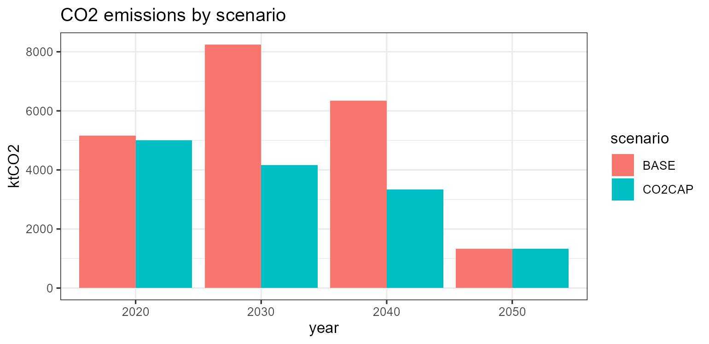

# Workflow: working with results and scenarios

Once a model is **built** (see *Model bricks* and *UTOPIA I*) and
**solved** (see *Solver backends* and *UTOPIA II*), a handful of utility
functions do the rest of the day-to-day work: pull objects and results
out, edit a piece and re-solve, organize scenarios on disk, and compare
runs. This article tours that layer.

``` r

library(energyRt)
library(dplyr)
library(ggplot2)
```

We use the packaged single-region UTOPIA kit as a running example, and
keep all scenario files under a temporary folder.

``` r

set_scenarios_path(file.path(tempdir(), "wf"))   # where scenarios are written

um  <- utopia_modules$electricity$reg1
mod <- newModel("UTOPIA", data = um$repo,
                calendar = utopia_modules$calendars$utopia_s4h24,
                region   = um$regions,
                horizon  = utopia_modules$horizons$base, discount = 0.05)
```

``` r

# interpolate + solve on the bundled GLPK; echo = FALSE keeps the log quiet
scen <- interpolate_model(mod, name = "BASE") |>
  solve_scenario(solver = solver_options$glpk, echo = FALSE)
```

## Selecting objects: `getObject()`

[`getObject()`](https://energyRt.org/reference/getObject.md) returns the
*building-block objects* held in a repository, model or scenario,
filtered by **class**, **name**, **description**, **region** or any
object slot. It is the object-level counterpart of
[`getData()`](https://energyRt.org/reference/getData.md) (which returns
their data). By default it returns a named list keyed by object name;
`drop = TRUE` unwraps a single match into the object itself.

``` r

repo <- um$repo
names(getObject(repo, class = "technology"))        # all technologies
#> [1] "ECOA" "EGAS" "ENUC" "ESOL" "EWIN" "EHYD" "EBIO"
names(getObject(repo, class = "supply", region = "R1"))
#> [1] "SUP_COA" "SUP_BIO" "SUP_NUC" "RES_SOL" "RES_WIN"
getObject(repo, name = "ECOA", drop = TRUE)@invcost # the ECOA object itself
#>   region year invcost wacc eac retcost
#> 1   <NA>   NA    2000   NA  NA      NA
```

Region matching reads `@region` slots and the `region`/`src`/`dst`
columns of any data.frame slot, so it works for every class;
region-agnostic objects (e.g. commodities) match every region.
[`getObject()`](https://energyRt.org/reference/getObject.md) accepts a
`scenario` too, so the same query works before or after solving.

## Extracting data: `getData()`

[`getData()`](https://energyRt.org/reference/getData.md) pulls
**parameter** and **variable** data out of a scenario as tidy
data.frames. With `merge = TRUE` it returns one long frame (a named list
otherwise); every frame carries a `scenario` and a `name` column.

``` r

getData(scen, "vObjective", merge = TRUE)$value      # total system cost, MEUR
#> [1] 13007.08

gen <- getData(scen, "vTechOut", comm = "ELC", merge = TRUE)
head(gen[, c("scenario", "tech", "region", "year", "slice", "value")], 4)
#> # A tibble: 4 × 6
#>   scenario tech  region  year slice  value
#>   <chr>    <chr> <chr>  <int> <chr>  <dbl>
#> 1 BASE     ECOA  R1      2020 ANNUAL 21.7 
#> 2 BASE     ECOA  R1      2030 ANNUAL 34.7 
#> 3 BASE     ECOA  R1      2040 ANNUAL 25.5 
#> 4 BASE     EGAS  R1      2040 ANNUAL  2.82
```

The `...` accept set filters, exact (`comm = "ELC"`) or regex
(`comm_ = "^EL"`). `timeframe = c("lowest","highest","all")` controls
how slice-indexed values are returned. Rename dimensions or recode
values on the way out with `newNames =` / `newValues =` (or afterwards
with [`renameSets()`](https://energyRt.org/reference/renameSets.md) /
[`revalueSets()`](https://energyRt.org/reference/revalueSets.md)), and
discover which parameters carry a given set with
[`findData()`](https://energyRt.org/reference/findData.md):

``` r

names(findData(scen, setsNames_ = "tech"))           # parameters indexed by 'tech'
#>  [1] "pTechWeatherAf"       "pTechWeatherAfs"      "pTechWeatherAfc"     
#>  [4] "pTechCap2act"         "pTechEac"             "pTechEmisComm"       
#>  [7] "pTechOlife"           "pTechFixom"           "pTechInvcost"        
#> [10] "pTechStock"           "pTechVarom"           "pTechAf"             
#> [13] "pTechRampUp"          "pTechRampDown"        "pTechAfs"            
#> [16] "pTechGinp2use"        "pTechCinp2ginp"       "pTechUse2cact"       
#> [19] "pTechAct2AInp"        "pTechCap2AInp"        "pTechAct2AOut"       
#> [22] "pTechCap2AOut"        "pTechNCap2AInp"       "pTechNCap2AOut"      
#> [25] "pTechCinp2AInp"       "pTechCout2AInp"       "pTechCinp2AOut"      
#> [28] "pTechCout2AOut"       "pTechCact2cout"       "pTechCinp2use"       
#> [31] "pTechCvarom"          "pTechAvarom"          "pTechShare"          
#> [34] "pTechAfc"             "pTechCap"             "pTechNewCap"         
#> [37] "pTechRet"             "pTechRetCost"         "vTechInv"            
#> [40] "vTechEac"             "vTechRetCost"         "vTechFixom"          
#> [43] "vTechVarom"           "vTechNewCap"          "vTechRetiredStockCum"
#> [46] "vTechRetiredStock"    "vTechRetiredNewCap"   "vTechCap"            
#> [49] "vTechAct"             "vTechInp"             "vTechOut"            
#> [52] "vTechAInp"            "vTechAOut"            "vTechEmsFuel"
```

`find_in_model(mod, "ECOA")` text-searches every object slot for a value
— handy for locating where a name is used.

## Editing an object: `update()`

[`update()`](https://energyRt.org/reference/newDemand.html) edits the
slots of a **single** model object (a technology, commodity, demand, …).
It does **not** operate on a whole model or scenario — you update the
object, put it back into the repository with
`add(..., overwrite = TRUE)`, and re-interpolate/solve.

``` r

ECOA <- getObject(repo, name = "ECOA", drop = TRUE)
ECOA <- update(ECOA, invcost = data.frame(invcost = 2500))  # pricier coal capex
repo_hi <- add(repo, ECOA, overwrite = TRUE)                # swap it back in

mod_hi  <- newModel("UTOPIA_HI", data = repo_hi,
                    calendar = utopia_modules$calendars$utopia_s4h24,
                    region = um$regions, horizon = utopia_modules$horizons$base,
                    discount = 0.05)
```

(For an already-interpolated scenario,
`update_parameter(scen, param, data)` writes rows straight into its
parameter store.)

## Scenario folders and structure

The scenarios directory is an option — read it with
[`get_scenarios_path()`](https://energyRt.org/reference/options.md), set
it with
[`set_scenarios_path()`](https://energyRt.org/reference/options.md)
(default `"scenarios/"`). Each scenario gets its own folder, named by
[`make_scenario_dirname()`](https://energyRt.org/reference/make_scenario_dirname.md)
as `name_model_calendar_horizon`:

``` r

get_scenarios_path()
#> [1] "C:\\Users\\admin\\AppData\\Local\\Temp\\RtmpMPAFa0/wf"
make_scenario_dirname(scen)
#> [1] "BASE_UTOPIA_utopia_s4h24_base"
```

Saving a scenario writes an **Arrow-backed** folder that mirrors the
scenario’s structure — a thin `scen.RData` shell plus each large data
slot as a dataset:

    <scenarios-path>/<name_model_calendar_horizon>/
    ├── scen.RData          # thinned S4 scenario shell
    ├── class · format      # "scenario" · "parquet"
    ├── logfile.csv         # timestamped save log
    ├── model/data/<repo>/<object>/<slot>/   # the model objects' data
    ├── modInp/parameters/<param>/           # interpolated input parameters
    ├── modOut/variables/<var>/              # solved variables (vTechOut, ...)
    └── script/<backend>_<solver>_<method>/  # solver working directory

A scenario knows whether its data is in RAM or on disk via
[`isInMemory()`](https://energyRt.org/reference/isInMemory.md); when on
disk, the slots are empty and read lazily from the folder on demand.

## Saving and loading

[`save_scenario()`](https://energyRt.org/reference/save_scenario.md)
spills the scenario to its folder and returns the (now on-disk) object;
`load_scenario(path, env = NULL)` reads the shell back. Its data stays
on disk until requested —
[`getData()`](https://energyRt.org/reference/getData.md) reads it
lazily, or [`obj2mem()`](https://energyRt.org/reference/obj2mem.md)
pulls the whole scenario back into memory.

``` r

saved <- save_scenario(scen, verbose = FALSE)
ld    <- load_scenario(saved@path, env = NULL, verbose = FALSE)
```

``` r

basename(saved@path)                                 # the scenario folder
#> [1] "BASE_UTOPIA_utopia-s4h24_base"
isInMemory(saved)                                    # FALSE -- data is on disk
#> [1] FALSE
getData(ld, "vObjective", merge = TRUE)$value        # lazy read, no full load
#> [1] 13007.08
```

``` r

ld <- obj2mem(ld)                                    # rehydrate fully into RAM
```

``` r

isInMemory(ld)
#> [1] TRUE
```

> A name-based scenario **registry**
> ([`register()`](https://energyRt.org/reference/register.md),
> `getScenario()`,
> [`get_registry()`](https://energyRt.org/reference/get_registry.md)) is
> under development; for now, organize runs with
> [`set_scenarios_path()`](https://energyRt.org/reference/options.md)
> and round-trip them with
> [`save_scenario()`](https://energyRt.org/reference/save_scenario.md) /
> [`load_scenario()`](https://energyRt.org/reference/load_scenario.md).

## Comparing scenarios

Layer a policy lever onto the base model to get a second scenario, then
pass a **named list of scenarios** to
[`getData()`](https://energyRt.org/reference/getData.md) — the
`scenario` column makes the comparison a one-liner:

``` r

scen_cap <- interpolate_model(mod, "CO2CAP", um$CO2_CAP) |>   # add the CO2 cap lever
  solve_scenario(solver = solver_options$glpk, echo = FALSE)
```

``` r

emis <- getData(list(BASE = scen, CO2CAP = scen_cap), "vEmsFuelTot",
                comm = "CO2", merge = TRUE)

emis |>
  group_by(scenario, year) |> summarise(ktCO2 = sum(value), .groups = "drop") |>
  ggplot(aes(factor(year), ktCO2, fill = scenario)) +
  geom_col(position = "dodge") +
  labs(x = "year", title = "CO2 emissions by scenario") + theme_bw()
```



``` r

sapply(list(BASE = scen, CO2CAP = scen_cap),
       function(s) round(getData(s, "vObjective", merge = TRUE)$value[1]))
#>   BASE CO2CAP 
#>  13007  13427
```

To reason about **model size** rather than results,
[`model_size()`](https://energyRt.org/reference/model_size.md) estimates
the parameter/variable/constraint counts of an interpolated scenario,
and [`size()`](https://energyRt.org/reference/size.md) reports its
in-memory footprint:

``` r

model_size(scen)
#> model_size: BASE
#>   parameters : 122 value, 236 maps, 13 sets
#>   param rows : 5,938
#>   estimate   : ~15,338 variables, ~16,832 constraints (from gating maps)
#>   top parameters by rows:
#>     pTechCinp2use      1,536
#>     pWeather           1,004
#>     pSliceWeight       404
#>     pExportRowPrice    404
#>     pExportRow         404
#>     pSliceAgg          400
#>     pDemand            384
#>     pTechAf            384
#>     pStorageInpEff     384
#>     pStorageOutEff     384
#>     pSliceShare        101
#>     pTechFixom         23
#>     pTechEac           20
#>     pTechInvcost       20
#>     pTechStock         14
size(scen)
#> [1] "6 Mb"
```

For a systematic check that a build is correct *and* efficient,
`compare_interp_settings(mod)` and
`compare_solve_settings(mod, solvers = ...)` interpolate (and solve) the
model under different storage settings and tabulate build size, time and
— crucially — confirm the objective is invariant across
`fold`/`sparse`/`prune`. These run several builds, so they are best run
interactively:

``` r

compare_interp_settings(mod)                          # size/time by setting
compare_solve_settings(mod, solvers = list(solver_options$glpk))
```

## See also

- **Model bricks** and **UTOPIA I** — building the objects and the
  model.
- **Solver backends** and **UTOPIA II** — interpolating and solving.
- [`?getData`](https://energyRt.org/reference/getData.md),
  [`?getObject`](https://energyRt.org/reference/getObject.md),
  [`?update`](https://energyRt.org/reference/newDemand.html),
  [`?save_scenario`](https://energyRt.org/reference/save_scenario.md),
  [`?load_scenario`](https://energyRt.org/reference/load_scenario.md),
  [`?model_size`](https://energyRt.org/reference/model_size.md),
  [`?compare_solve_settings`](https://energyRt.org/reference/compare_solve_settings.md).
