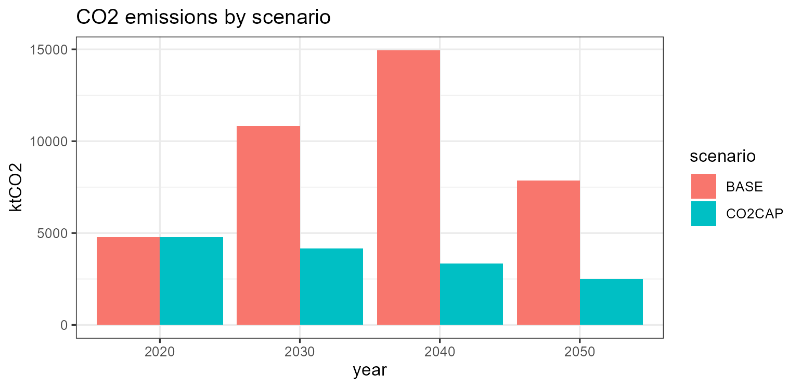

# Workflow: working with results and scenarios

Once a model is **built** (see *Model bricks* and *UTOPIA I*) and
**solved** (see *Solver backends* and *UTOPIA II*), a handful of utility
functions do the rest of the day-to-day work: pull objects and results
out, edit a piece and re-solve, organize scenarios on disk, and compare
runs. This article tours that layer.

``` r

library(energyRt)
library(dplyr)
library(ggplot2)
```

We use the packaged single-region UTOPIA kit as a running example, and
keep all scenario files under a temporary folder.

``` r

set_scenarios_path(file.path(tempdir(), "wf"))   # where scenarios are written
set_registry_file(file.path(tempdir(), "wf", "energyRt_registry.csv"))

um  <- utopia$modules$electricity$R1
mod <- newModel("UTOPIA", data = um$repo,
                calendar = utopia$modules$calendars$s4_h24,
                region   = um$regions,
                horizon  = utopia$modules$horizons$base, discount = 0.05)
```

``` r

# interpolate + solve on the bundled GLPK; echo = FALSE keeps the log quiet
scen <- interpolate_model(mod, name = "BASE") |>
  solve_scenario(solver = solver_options$glpk, echo = FALSE)
```

## Selecting objects: `getObject()`

[`getObject()`](https://energyRt.org/reference/getObject.md) returns the
*building-block objects* held in a repository, model or scenario,
filtered by **class**, **name**, **description**, **region** or any
object slot. It is the object-level counterpart of
[`getData()`](https://energyRt.org/reference/getData.md) (which returns
their data). By default it returns a named list keyed by object name;
`drop = TRUE` unwraps a single match into the object itself.

``` r

repo <- um$repo
names(getObject(repo, class = "technology"))        # all technologies
#> [1] "ECOA" "EGAS" "ENUC" "ESOL" "EWIN" "EHYD" "EBIO"
names(getObject(repo, class = "supply", region = "R1"))
#> [1] "SUP_COA" "SUP_BIO" "SUP_NUC" "RES_SOL" "RES_WIN"
getObject(repo, name = "ECOA", drop = TRUE)@invcost # the ECOA object itself
#>   vintage cluster region year invcost wacc payback eac retcost
#> 1    <NA>    <NA>   <NA>   NA    2000   NA      NA  NA      NA
```

Region matching reads `@region` slots and the `region`/`src`/`dst`
columns of any data.frame slot, so it works for every class;
region-agnostic objects (e.g. commodities) match every region.
[`getObject()`](https://energyRt.org/reference/getObject.md) accepts a
`scenario` too, so the same query works before or after solving.

## Extracting data: `getData()`

[`getData()`](https://energyRt.org/reference/getData.md) pulls
**parameter** and **variable** data out of a scenario as tidy
data.frames. With `merge = TRUE` it returns one long frame (a named list
otherwise); every frame carries a `scenario` and a `name` column.

``` r

getData(scen, "vObjective", merge = TRUE)$value      # total system cost, MEUR
#> [1] 12999.41

gen <- getData(scen, "vTechOut", comm = "ELC", merge = TRUE)
head(gen[, c("scenario", "tech", "region", "year", "timeslice", "value")], 4)
#> # A tibble: 4 × 6
#>   scenario tech  region  year timeslice  value
#>   <chr>    <chr> <chr>  <int> <chr>      <dbl>
#> 1 BASE     ECOA  R1      2020 WIN_h00   0.151 
#> 2 BASE     ECOA  R1      2020 WIN_h01   0.0882
#> 3 BASE     ECOA  R1      2020 WIN_h02   0.0501
#> 4 BASE     ECOA  R1      2020 WIN_h03   0.0253
```

The `...` accept set filters, exact (`comm = "ELC"`) or regex
(`comm_ = "^EL"`). `timeframe = c("lowest","highest","all")` controls
how timeslice-indexed values are returned. Rename dimensions or recode
values on the way out with `newNames =` / `newValues =` (or afterwards
with [`renameSets()`](https://energyRt.org/reference/renameSets.md) /
[`revalueSets()`](https://energyRt.org/reference/revalueSets.md)), and
discover which parameters carry a given set with
[`findData()`](https://energyRt.org/reference/findData.md):

``` r

names(findData(scen, setsNames_ = "tech"))           # parameters indexed by 'tech'
#>  [1] "pTechWeatherAf"     "pTechWeatherAfs"    "pTechWeatherAfc"   
#>  [4] "pTechCap2act"       "pTechEac"           "pTechWacc"         
#>  [7] "pTechPayback"       "pTechEmisComm"      "pTechOlife"        
#> [10] "pTechFixom"         "pTechInvcost"       "pTechStock"        
#> [13] "pTechStockNew"      "pTechStockSurv"     "pTechVarom"        
#> [16] "pTechAf"            "pTechRampUp"        "pTechRampDown"     
#> [19] "pTechAfs"           "pTechGinp2use"      "pTechCinp2ginp"    
#> [22] "pTechUse2cact"      "pTechAct2AInp"      "pTechCap2AInp"     
#> [25] "pTechAct2AOut"      "pTechCap2AOut"      "pTechNCap2AInp"    
#> [28] "pTechNCap2AOut"     "pTechPho2AInp"      "pTechPho2AOut"     
#> [31] "pTechRet2AInp"      "pTechRet2AOut"      "pTechCinp2AInp"    
#> [34] "pTechCout2AInp"     "pTechCinp2AOut"     "pTechCout2AOut"    
#> [37] "pTechCact2cout"     "pTechCinp2use"      "pTechCvarom"       
#> [40] "pTechAvarom"        "pTechShare"         "pTechAfc"          
#> [43] "pTechCap"           "pTechNewCap"        "pTechRet"          
#> [46] "pTechRetCost"       "vTechAInp"          "vTechAOut"         
#> [49] "vTechAct"           "vTechCap"           "vTechEac"          
#> [52] "vTechFixom"         "vTechInp"           "vTechInv"          
#> [55] "vTechNewCap"        "vTechOut"           "vTechRetCost"      
#> [58] "vTechRetiredNewCap" "vTechRetiredStock"  "vTechPhaseOut"     
#> [61] "vTechStockCap"      "vTechStockPhaseOut" "vTechVarom"        
#> [64] "vTechEmsFuel"
```

`find_in_model(mod, "ECOA")` text-searches every object slot for a value
— handy for locating where a name is used.

## Editing an object: `update()`

[`update()`](https://energyRt.org/reference/newDemand.html) edits the
slots of a **single** model object (a technology, commodity, demand, …).
It does **not** operate on a whole model or scenario — you update the
object, put it back into the repository with
`add(..., overwrite = TRUE)`, and re-interpolate/solve.

``` r

ECOA <- getObject(repo, name = "ECOA", drop = TRUE)
ECOA <- update(ECOA, invcost = data.frame(invcost = 2500))  # pricier coal capex
repo_hi <- add(repo, ECOA, overwrite = TRUE)                # swap it back in

mod_hi  <- newModel("UTOPIA_HI", data = repo_hi,
                    calendar = utopia$modules$calendars$s4_h24,
                    region = um$regions, horizon = utopia$modules$horizons$base,
                    discount = 0.05)
```

(For an already-interpolated scenario,
`update_parameter(scen, param, data)` writes rows straight into its
parameter store.)

## Scenario folders and structure

(The *Scenario management* article explains this layer in depth —
stores, manifests, the registry, runs, and variants; this section is the
quick tour.)

The scenarios directory is an option — read it with
[`get_scenarios_path()`](https://energyRt.org/reference/scenarios_path.md),
set it with
[`set_scenarios_path()`](https://energyRt.org/reference/scenarios_path.md)
(default `"scenarios/"`). Each scenario gets its own folder, named
automatically as `name-model-calendar-horizon` (parts joined by dashes,
which valid names cannot contain; duplicate parts are dropped, so a
scenario and model sharing a name appear once):

``` r

get_scenarios_path()
#> [1] "C:\\Users\\admin\\AppData\\Local\\Temp\\RtmpMlim5W/wf"
basename(scen@path)
#> [1] "BASE-UTOPIA-s4_h24-base"
```

Saving a scenario writes an **Arrow-backed** folder that mirrors the
scenario’s structure — a thin `scen.RData` shell, a `scenario.yml`
manifest, each large data slot as a dataset, and one folder per solver
run:

    <scenarios-path>/<name-model-calendar-horizon>/
    ├── scenario.yml        # manifest: model ref/hash, calendar, horizon,
    │                       #   `default:` — the default run (user-changeable)
    ├── scen.RData          # thinned S4 scenario shell
    ├── class · format · layout   # "scenario" · "parquet" · "3"
    ├── logfile.csv         # timestamped save log
    ├── model/data/<repo>/<object>/<slot>/   # model data (embedded scenarios only)
    ├── modInp/parameters/<param>/           # interpolated input parameters
    └── runs/               # one folder per solve
        ├── glpk/           #   base-problem run, named by its solve label
        │   ├── run.yml     #     provenance: solver, cmdline, times, objective
        │   ├── solver/     #     the solver working dir (inputs + its output/)
        │   └── modOut/variables/<var>/      # the solved variables
        └── julia_highs/    #   another backend's run of the same problem

Beyond the per-scenario traces above, an optional *operation log*
records the sequence of a working session:
`set_log_file("energyRt_log.csv")` makes
[`interpolate_model()`](https://energyRt.org/reference/interpolate_model.md),
[`solve_scenario()`](https://energyRt.org/reference/solve_model.md) and
[`solve_myopic()`](https://energyRt.org/reference/solve_myopic.md)
append one line each (operation, object, status, objective, duration),
and [`read_log()`](https://energyRt.org/reference/log.md) returns the
sequence as a tibble. It is off by default.

Solving the same scenario with several backends (or option sets — pass
`run = "<label>"` to
[`solve_scenario()`](https://energyRt.org/reference/solve_model.md))
keeps every run side by side; `scenario_runs(scen)` lists them with
status and objective, and `read_solution(scen, run = "<label>")`
switches the active solution. A scenario referencing a model saved with
[`save_model()`](https://energyRt.org/reference/model_store.md) skips
the embedded `model/` copy entirely (see
[`?save_scenario`](https://energyRt.org/reference/save_scenario.md),
`embed_model`).

A scenario knows whether its data is in RAM or on disk via
[`isInMemory()`](https://energyRt.org/reference/isInMemory.md); when on
disk, the slots are empty and read lazily from the folder on demand.
Folders from older energyRt versions are still readable and migrate in
place with `upgrade_scenario_layout(path)`.

## Saving and loading

[`save_scenario()`](https://energyRt.org/reference/save_scenario.md)
spills the scenario to its folder and returns the (now on-disk) object;
`load_scenario(path, env = NULL)` reads the shell back. Its data stays
on disk until requested —
[`getData()`](https://energyRt.org/reference/getData.md) reads it
lazily, or [`obj2mem()`](https://energyRt.org/reference/obj2mem.md)
pulls the whole scenario back into memory.

``` r

saved <- save_scenario(scen, verbose = FALSE)
ld    <- load_scenario(saved@path, env = NULL, verbose = FALSE)
```

A saved scenario is also reachable by its registered **name** —
`load_scenario("BASE", env = NULL)` resolves it through the project
registry, and the cached accessor `getScenario("BASE")` is the everyday
short form (see the *Scenario management* article):

``` r

identical(getScenario("BASE")@name, ld@name)
#> [1] TRUE
```

``` r

basename(saved@path)                                 # the scenario folder
#> [1] "BASE-UTOPIA-s4_h24-base"
isInMemory(saved)                                    # FALSE -- data is on disk
#> [1] FALSE
getData(ld, "vObjective", merge = TRUE)$value        # lazy read, no full load
#> [1] 12999.41
```

``` r

ld <- obj2mem(ld)                                    # rehydrate fully into RAM
```

``` r

isInMemory(ld)
#> [1] TRUE
```

Every
[`save_scenario()`](https://energyRt.org/reference/save_scenario.md) /
[`save_model()`](https://energyRt.org/reference/model_store.md) /
[`save_repository()`](https://energyRt.org/reference/repo_store.md) also
records its object in the project **registry** — a single CSV (default
`energyRt_registry.csv` at the project root, see
[`get_registry_file()`](https://energyRt.org/reference/registry_file.md))
indexing saved models, repositories, scenarios, and runs. Repositories
shared by several models can be stored once with
[`save_repository()`](https://energyRt.org/reference/repo_store.md) and
referenced by each model (`save_model(embed_repos = )`), just as
scenarios can reference a stored model.
[`load_registry()`](https://energyRt.org/reference/registry.md) reads
it, [`find_in_registry()`](https://energyRt.org/reference/registry.md)
filters it (by type, name, or model hash), and
[`refresh_registry()`](https://energyRt.org/reference/registry.md)
rebuilds it by rescanning the `scenarios/` and `models/` stores — the
on-disk manifests are the source of truth, so the registry can always be
reconstructed.

## Comparing scenarios

Layer a policy lever onto the base model to get a second scenario, then
pass a **named list of scenarios** to
[`getData()`](https://energyRt.org/reference/getData.md) — the
`scenario` column makes the comparison a one-liner. (Scenarios already
*saved* compare by name alone: `getData(c("BASE", "CO2CAP"), ...)` loads
them from the registry on the fly.)

``` r

scen_cap <- interpolate_model(mod, "CO2CAP", um$CO2_CAP) |>   # add the CO2 cap lever
  solve_scenario(solver = solver_options$glpk, echo = FALSE)
```

``` r

emis <- getData(list(BASE = scen, CO2CAP = scen_cap), "vEmsFuelTot",
                comm = "CO2", merge = TRUE)

emis |>
  group_by(scenario, year) |> summarise(ktCO2 = sum(value), .groups = "drop") |>
  ggplot(aes(factor(year), ktCO2, fill = scenario)) +
  geom_col(position = "dodge") +
  labs(x = "year", title = "CO2 emissions by scenario") + theme_bw()
```



``` r

sapply(list(BASE = scen, CO2CAP = scen_cap),
       function(s) round(getData(s, "vObjective", merge = TRUE)$value[1]))
#>   BASE CO2CAP 
#>  12999  13413
```

To reason about **model size** rather than results,
[`model_size()`](https://energyRt.org/reference/model_size.md) estimates
the parameter/variable/constraint counts of an interpolated scenario,
and [`size()`](https://energyRt.org/reference/size.md) reports its
in-memory footprint:

``` r

model_size(scen)
#> model_size: BASE
#>   parameters : 170 value, 297 maps, 13 sets
#>   param rows : 5,927
#>   estimate   : ~16,178 variables, ~16,852 constraints (from gating maps)
#>   top parameters by rows:
#>     pTechCinp2use      1,536
#>     pWeather           1,004
#>     pTimesliceWeight   404
#>     pTimesliceAgg      400
#>     pDemand            384
#>     pExportRowPrice    384
#>     pExportRow         384
#>     pTechAf            384
#>     pStorageInpEff     384
#>     pStorageOutEff     384
#>     pTimesliceShare    101
#>     pTechFixom         23
#>     pTechEac           20
#>     pTechInvcost       20
#>     pTechStock         14
size(scen)
#> [1] "7 Mb"
```

For a systematic check that a build is correct *and* efficient,
`compare_interp_settings(mod)` and
`compare_solve_settings(mod, solvers = ...)` interpolate (and solve) the
model under different storage settings and tabulate build size, time and
— crucially — confirm the objective is invariant across
`fold`/`sparse`/`prune`. These run several builds, so they are best run
interactively:

``` r

compare_interp_settings(mod)                          # size/time by setting
compare_solve_settings(mod, solvers = list(solver_options$glpk))
```

## Sampling: solving a subset of the model

Interpolation can solve a *sample* of a model without editing the model
itself — in time (a sampled calendar) and in space (a sampled geoscale).
Both work the same way: build the sample object, pass it to
[`interpolate_model()`](https://energyRt.org/reference/interpolate_model.md),
and the scenario is declared, validated and solved on the sample.

### Sampled calendars

A sampled calendar is a **row subset of the full calendar’s timetable**
plus an explicit `year_fraction` — the fraction of the year the sample
covers. Timeslice weights annualise the sample inside the solver (the
top slice carries weight `1/year_fraction`), so the objective is an
*estimate* of the full model’s — and exactly equals it when the sampled
slices are representative:

``` r

tt  <- utopia$modules$calendars$s4_h24@timetable
tt2 <- tt[tt$SEASON %in% c("WIN", "SUM"), ]      # two of the four seasons
cal2 <- newCalendar(timetable = tt2, name = "s2h24",
                    year_fraction = sum(tt2$share))

scen_t <- interpolate_model(mod, "S2", cal2) |>
  solve_scenario(solver = solver_options$glpk, echo = FALSE)
sapply(list(full = scen, sampled = scen_t),
       function(s) round(getData(s, "vObjective", merge = TRUE)$value[1]))
#>    full sampled 
#>   12999   13505
```

Two traps: pass `year_fraction` **explicitly** (it is not recomputed
from the subset), and **subset the existing timetable** rather than
rebuilding one with
[`make_timetable()`](https://energyRt.org/reference/calendar.md) (which
would renormalise the shares to a full year). Declarations are validated
against the *model’s* calendar, so objects naming out-of-sample
timeslices interpolate cleanly — their out-of-sample rows are simply
filtered.

### Spatial sampling

The spatial mirror: pass a **filtered geoscale** — a
[`geoscales::filter_geoscale()`](https://optimal2050.github.io/geoscales/r/reference/filter_geoscale.html)
subset of the model’s regions — and the scenario becomes a
*sub-territory* model: only the sampled regions are declared,
out-of-sample parameter rows are filtered, and trade routes crossing the
sample boundary are dropped (with a message). Unlike calendar sampling
there is **no reweighting**: regional quantities are extensive, so the
objective is the sub-territory’s own, and disjoint samples *add up* to
the full model (absent cross-boundary trade).

UTOPIA is single-region, so a compact three-region demo:

``` r

library(geoscales)

r3 <- c("R1", "R2", "R3")
gs <- geoscale_from_leaftable(
  data.frame(zone = c("Z12", "Z12", "Z3"), region = r3, km2 = 1),
  geoframes = c("zone", "region"), name = "demo")

m3 <- newModel(
  "M3", region = r3, horizon = newHorizon(2020), discount = 0.05,
  repo = newRepository(
    "r",
    newCommodity("COA", timeframe = "ANNUAL"),
    newCommodity("ELC", timeframe = "ANNUAL"),
    newSupply("SUP_COA", commodity = "COA",
              supply = data.frame(region = r3, cost = 5)),
    newTechnology("ECOA", input = list(comm = "COA"),
                  output = list(comm = "ELC"),
                  af = data.frame(af.up = 0.9),
                  invcost = data.frame(invcost = 1000),
                  olife = list(olife = 30), cap2act = 1),
    newDemand("DEM_ELC", commodity = "ELC",
              demand = data.frame(region = r3, demand = c(10, 20, 30))),
    newTrade("TR23", commodity = "ELC", cap2act = 1,
             routes = data.frame(src = "R2", dst = "R3"),
             trade  = data.frame(src = "R2", dst = "R3", ava.up = 4),
             invcost = data.frame(invcost = 10))))
```

Filtering the geoscale to `R1 + R2` and interpolating drops the
`R2 -> R3` route on the way:

``` r

gs12 <- filter_geoscale(gs, "region", c("R1", "R2"),
                        drop_empty_geoframes = TRUE)
scen12 <- interpolate_model(m3, "S12", gs12)
#> spatial sample: dropping trade route TR23: R2 -> R3 (no boundary price; no stub)
#> spatial sample: removing trade TR23 (no route inside the sample)
as.character(scen12@settings@region)
#> [1] "R1" "R2"
```

A dropped route can optionally leave a **priced boundary stub** at the
kept endpoint — an export (kept source) or import (kept destination)
object bounded by `cap.up` (or, failing that, the route’s `ava.up`) —
via `boundary_prices`; routes without a price row are just dropped:

``` r

bp <- data.frame(src = "R2", dst = "R3", price = 50, cap.up = 4)
scen12p <- interpolate_model(m3, "S12P", gs12, boundary_prices = bp)
#> spatial sample: dropping trade route TR23: R2 -> R3 (EXP_TR23_R22R3 stub added)
#> spatial sample: removing trade TR23 (no route inside the sample)
grep("^EXP", as.character(scen12p@modInp@sets$expp), value = TRUE)
#> [1] "EXP_TR23_R22R3"
```

The same surgery is available up front, as a model-to-model verb:

``` r

m12 <- subset_model_regions(m3, c("R1", "R2"), boundary_prices = bp)
as.character(m12@config@region)
#> [1] "R1" "R2"
```

The filtered geoscale records its **coverage** (fraction of each
weight’s parent total — see
[`geoscales::geoscale_coverage()`](https://optimal2050.github.io/geoscales/r/reference/geoscale_coverage.html)),
and its name is mangled (`"demo[region:R1+R2]"`) so different samples of
one parent never collide in caches or joins. A **pruned** geoscale (a
coarser level of the model’s own hierarchy) requests a full-territory
solve at the parent level instead; that requires aggregating the model’s
data (`aggregate_model_regions()`) and is not implemented yet.

## See also

- **Model bricks** and **UTOPIA I** — building the objects and the
  model.
- **Solver backends** and **UTOPIA II** — interpolating and solving.
- [`?getData`](https://energyRt.org/reference/getData.md),
  [`?getObject`](https://energyRt.org/reference/getObject.md),
  [`?update`](https://energyRt.org/reference/newDemand.html),
  [`?save_scenario`](https://energyRt.org/reference/save_scenario.md),
  [`?load_scenario`](https://energyRt.org/reference/load_scenario.md),
  [`?model_size`](https://energyRt.org/reference/model_size.md),
  [`?compare_solve_settings`](https://energyRt.org/reference/compare_solve_settings.md),
  [`?subset_model_regions`](https://energyRt.org/reference/subset_model_regions.md).
